# Webproシステム アーキテクチャ図

## 1. システム全体アーキテクチャ（3層構造）

```mermaid
graph TB
    subgraph "利用者層"
        User[設計者・評価者]
    end

    subgraph "入力層"
        CSV[CSV入力シート<br/>様式0～8<br/>23種類]
    end

    subgraph "ドキュメント仕様層"
        subgraph "第1層: 計算仕様書"
            ER[EngineeringReference<br/>計算アルゴリズム定義]
            CH02[第2章: 空調設備<br/>351KB]
            CH03[第3章: 換気設備<br/>25KB]
            CH04[第4章: 照明設備<br/>52KB]
            CH05[第5章: 給湯設備<br/>45KB]
            CH06[第6章: 昇降機<br/>9.7KB]
            CH08[第8章: コージェネ<br/>96KB]
            CH09[第9章: その他<br/>3.6KB]
            CH10[第10章: 基準値<br/>14KB]
        end

        subgraph "第2層: 入出力変換仕様"
            CSV2XML[csv2xml/<br/>CSV→XML変換仕様<br/>23ファイル]
            COMMON[common.adoc<br/>共通変換ルール]
            BASIC[basic_information.adoc]
            ROOM[room.adoc]
            AC[空調関連<br/>8ファイル]
            VENT[換気関連<br/>3ファイル]
            LIGHT[lighting.adoc]
            HW[給湯関連<br/>2ファイル]
            ELEV[elevator.adoc]
            PV[photovoltaic_generation.adoc]
            CGS[コージェネ関連<br/>2ファイル]
        end

        subgraph "第3層: データスキーマ"
            A5ER[webpro_input_schema.a5er<br/>E-R図<br/>33エンティティ]
            PAGE1[基本情報・室仕様]
            PAGE2[空調システム]
            PAGE3[換気システム]
            PAGE4[照明・給湯]
            PAGE5[昇降機・発電]
            PAGE6[コージェネ]
            PAGE7[外皮・外壁・窓]
        end
    end

    subgraph "ビルド・デプロイ層"
        DOCKER[Docker + Asciidoctor]
        CI[CircleCI<br/>自動ビルド・デプロイ]
        GHP[GitHub Pages<br/>公開サイト]
    end

    subgraph "計算エンジン層 (別システム実装)"
        XML[XML入力データ]
        ENGINE[計算エンジン]
        RESULT[結果出力<br/>設計値・基準値]
    end

    subgraph "外部データソース"
        WEATHER[気象データ<br/>拡張アメダス<br/>1995年版]
        CONST[定数・係数<br/>国交省告示265号]
        MATERIAL[建材物性値<br/>機器特性データ]
    end

    User --> CSV
    CSV --> CSV2XML

    CSV2XML --> COMMON
    CSV2XML --> BASIC
    CSV2XML --> ROOM
    CSV2XML --> AC
    CSV2XML --> VENT
    CSV2XML --> LIGHT
    CSV2XML --> HW
    CSV2XML --> ELEV
    CSV2XML --> PV
    CSV2XML --> CGS

    COMMON -.定義参照.-> A5ER
    BASIC -.定義参照.-> PAGE1
    ROOM -.定義参照.-> PAGE1
    AC -.定義参照.-> PAGE2
    AC -.定義参照.-> PAGE7
    VENT -.定義参照.-> PAGE3
    LIGHT -.定義参照.-> PAGE4
    HW -.定義参照.-> PAGE4
    ELEV -.定義参照.-> PAGE5
    PV -.定義参照.-> PAGE5
    CGS -.定義参照.-> PAGE6

    A5ER --> PAGE1
    A5ER --> PAGE2
    A5ER --> PAGE3
    A5ER --> PAGE4
    A5ER --> PAGE5
    A5ER --> PAGE6
    A5ER --> PAGE7

    ER --> CH02
    ER --> CH03
    ER --> CH04
    ER --> CH05
    ER --> CH06
    ER --> CH08
    ER --> CH09
    ER --> CH10

    ER --> DOCKER
    CSV2XML --> DOCKER
    DOCKER --> CI
    CI --> GHP

    CSV2XML ==> XML
    XML --> ENGINE

    WEATHER --> ENGINE
    CONST --> ENGINE
    MATERIAL --> ENGINE

    CH02 -.計算仕様.-> ENGINE
    CH03 -.計算仕様.-> ENGINE
    CH04 -.計算仕様.-> ENGINE
    CH05 -.計算仕様.-> ENGINE
    CH06 -.計算仕様.-> ENGINE
    CH08 -.計算仕様.-> ENGINE
    CH09 -.計算仕様.-> ENGINE
    CH10 -.計算仕様.-> ENGINE

    ENGINE --> RESULT
    RESULT --> User

    GHP -.仕様公開.-> User

    style User fill:#e1f5ff
    style CSV fill:#fff4e1
    style XML fill:#fff4e1
    style ENGINE fill:#ffe1e1
    style RESULT fill:#e1ffe1
    style DOCKER fill:#f0f0f0
    style CI fill:#f0f0f0
    style GHP fill:#f0f0f0
    style WEATHER fill:#ffffcc
    style CONST fill:#ffffcc
    style MATERIAL fill:#ffffcc
```



## 2. レイヤー別の責務

### 第1層: 計算仕様書 (EngineeringReference)

**役割:** 全エネルギー計算アルゴリズムの定義

**成果物:**
- 数式（LaTeX形式）
- 計算フロー
- 技術的根拠
- 参考文献

**技術:**
- AsciiDoc記述
- 数式はLaTeX（stem記法）
- 画像・図表の埋め込み

### 第2層: 入出力変換仕様 (csv2xml)

**役割:** CSV入力シートからXML形式への変換ルール定義

**成果物:**
- 23様式の詳細マッピング
- 列挙値の変換表
- バリデーション規則

**特徴:**
- テーブル形式で列対応を定義
- 共通ルール（common.adoc）で一元管理
- 複数行にわたる定義（外壁11行単位等）に対応

### 第3層: データスキーマ (A5:ER)

**役割:** 入力データの論理構造定義

**成果物:**
- 33エンティティ定義
- リレーション（24個）
- データ型・制約
- 7つの論理ビュー

**特徴:**
- A5:SQL Mk-2で視覚化可能
- 外部キー参照による整合性
- 階層構造（Set→Unit等）

### ビルド・デプロイ層

**役割:** ドキュメントの自動HTML化と公開

**成果物:**
- HTML形式の仕様書
- GitHub Pages公開サイト
- 自動デプロイ履歴

**技術:**
- Docker（asciidoctorイメージ）
- CircleCI（2ジョブワークフロー）
- Git/GitHub（バージョン管理）

### 計算エンジン層 (別システム)

**役割:** 実際の計算実行（本プロジェクトは仕様定義のみ）

**入力:**
- XML形式の建物データ
- 気象データ
- 定数・係数データ

**出力:**
- 設計一次エネルギー消費量 E_T [GJ/年]
- 基準一次エネルギー消費量 E_ST [GJ/年]
- 設備別内訳

**実装例:**
- Java版
- Python版
- Excel版（CASCADE等）

## 3. 情報の流れ

```
利用者が様式0～8のCSVシートに入力
           ↓
CSV→XML変換仕様（本プロジェクト）に従って変換
           ↓
XML形式の統合入力データ生成
           ↓
計算エンジン（別システム）が読み込み
           ↓
計算仕様書（本プロジェクト）に従って計算実行
           ↓
気象データ・定数データと組み合わせて処理
           ↓
結果を利用者に提示
           ↓
利用者が仕様書（本プロジェクト公開サイト）で計算根拠を確認可能
```

## 4. 技術スタック

| レイヤー | 技術 | 用途 |
|---------|------|------|
| ドキュメント記述 | AsciiDoc | 仕様書の記述 |
| 数式表記 | LaTeX (stem記法) | 計算式の表現 |
| ER図 | A5:ER (A5:SQL Mk-2) | データスキーマ定義 |
| ビルド | Docker + Asciidoctor | HTML生成 |
| CI/CD | CircleCI | 自動ビルド・デプロイ |
| ホスティング | GitHub Pages | 公開サイト |
| バージョン管理 | Git/GitHub | ソース管理 |

## 5. 公開URL

**メインサイト:**
https://webpro-nr.github.io/BESJP_EngineeringReference/index.html

**CSV→XML仕様:**
https://webpro-nr.github.io/BESJP_EngineeringReference/csv2xml/index.html

**GitHubリポジトリ:**
https://github.com/WEBPRO-NR/BESJP_EngineeringReference

## 6. システムの特徴

### 6.1 仕様駆動型設計

- ドキュメントが真実のソース（Single Source of Truth）
- 計算実装は仕様に従う
- 複数の実装（Java、Python等）が可能

### 6.2 完全な透明性

- すべての計算根拠を公開
- GitHubでオープンソース化
- 誰でもアクセス・検証可能

### 6.3 保守性・拡張性

- テキストベースなので差分管理容易
- プルリクエストで変更履歴を記録
- モジュール化された設備別計算

### 6.4 国際標準対応

- LaTeX数式で言語非依存
- 国交省基準に準拠
- 科学的根拠を明示

### 6.5 継続的改善

- CircleCIで自動ビルド
- masterブランチ更新時に自動デプロイ
- バージョン履歴の完全な追跡

## 7. システムの位置づけ

Webproシステムは**建築物のエネルギー評価のための「仕様書管理システム」**です。

- **NOT**: 計算プログラム本体
- **BUT**: 計算方法と入出力形式を定義する中核的なドキュメント集

実際の計算は別システム（CASCADE、独自実装等）で行われますが、その計算方法はすべてこのシステムで定義・公開されています。

これにより：
- 計算の公平性・透明性を確保
- 異なる実装間の相互運用性を保証
- 継続的な改善とバージョン管理を実現

## 8. 開発・運用体制

**開発元:**
- 国土交通省 国土技術政策総合研究所
- 国立研究開発法人 建築研究所

**バージョン:**
- 現在: 3.0β（開発中）
- 公開中: 2.x（平成25年基準対応）

**更新頻度:**
- masterブランチへのpush時に自動デプロイ
- 計算仕様の改訂時に章別更新

**品質管理:**
- GitHubプルリクエストによるレビュー
- CircleCIによる自動ビルドチェック
- 誤字・数式エラーの継続的修正
