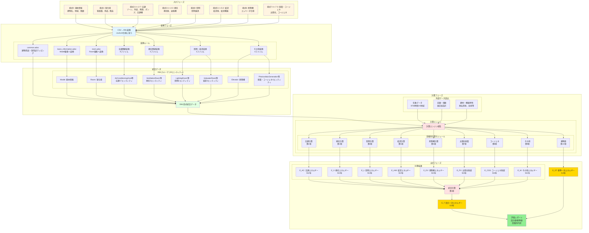
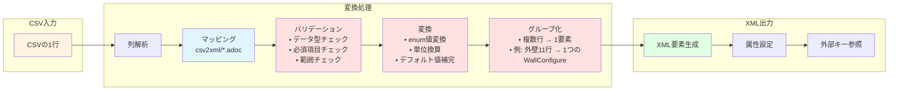
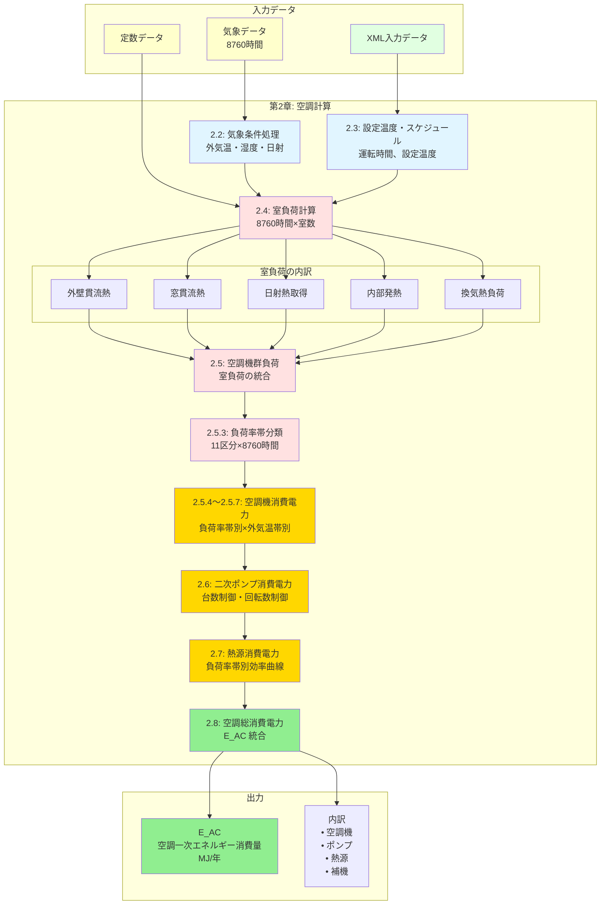
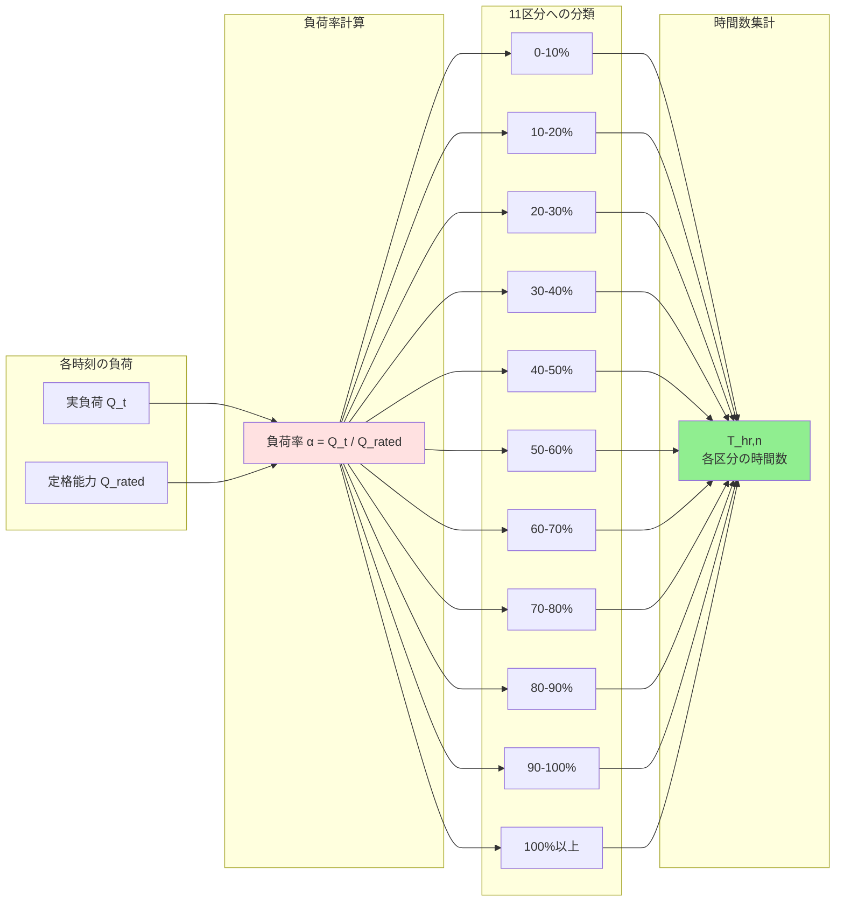
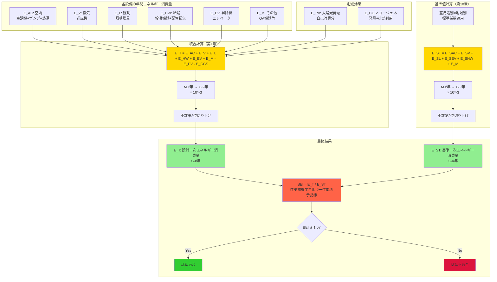
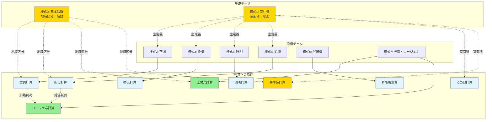
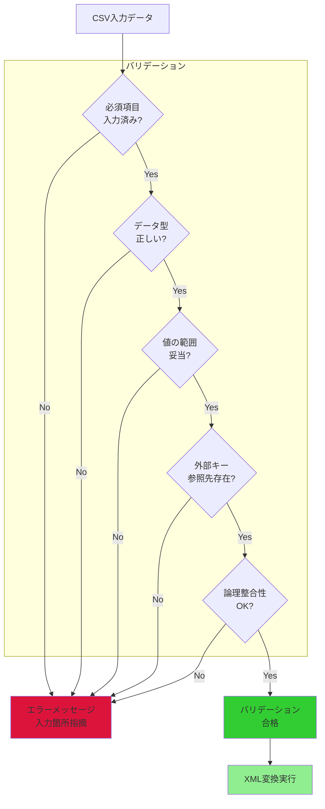

# データフロー図

## 1. 全体データフロー



## 2. CSV→XML変換の詳細フロー



### 2.1 変換の具体例

**例1: 様式1（室仕様）の変換**

```
CSV入力:
①階, ①室名, ②建物用途, ②室用途, ③室面積, ④階高, ⑤天井高, ⑥計算対象室
1, 事務室1, 事務所, 事務室, 50.0, 3.5, 2.7, ＃

↓ 変換処理

XML出力:
<Room>
  <Floor>1</Floor>
  <Name>事務室1</Name>
  <BuildingType>Office</BuildingType>
  <RoomType>OfficeRoom</RoomType>
  <RoomArea>50.0</RoomArea>
  <FloorHeight>3.5</FloorHeight>
  <RoomHeight>2.7</RoomHeight>
  <AirConditioning>true</AirConditioning>
  <Ventilation>false</Ventilation>
  <Lighting>false</Lighting>
  <Hotwater>false</Hotwater>
</Room>
```

**変換ポイント:**
- 「事務所」 → `BuildingType="Office"` (enum変換)
- 「事務室」 → `RoomType="OfficeRoom"` (enum変換)
- 「＃」記号の有無 → `AirConditioning=true/false` (boolean変換)

**例2: 様式2-2（外壁構成）の変換（11行単位）**

```
CSV入力:
①外壁名称, ②壁の種類, ③熱貫流率
外壁1, 外壁, 0.534
, ,
④建材番号, ⑤建材名称, ⑥厚み, ⑦備考
A101, コンクリート, 0.150,
A201, 断熱材, 0.050,
, , ,
, , ,
(以下空行まで11行)

↓ 変換処理（11行を1つの要素に統合）

XML出力:
<WallConfigure>
  <Name>外壁1</Name>
  <Type>Air</Type>
  <Uvalue>0.534</Uvalue>
  <Material>
    <Layer>1</Layer>
    <Number>A101</Number>
    <Name>コンクリート</Name>
    <Thickness>0.150</Thickness>
  </Material>
  <Material>
    <Layer>2</Layer>
    <Number>A201</Number>
    <Name>断熱材</Name>
    <Thickness>0.050</Thickness>
  </Material>
</WallConfigure>
```

**変換ポイント:**
- 11行単位でグループ化
- 「外壁」 → `Type="Air"` (enum変換)
- 建材層は④が入力されている行のみカウント
- 最大9層まで対応

## 3. 計算エンジンのデータフロー（空調計算の例）



### 3.1 負荷率帯分類の詳細



## 4. 計算結果の統合フロー



## 5. データの依存関係



## 6. データ量の推定

| データ種別 | データ量 | 説明 |
|----------|---------|------|
| CSV入力シート | 約1～10KB/様式 | 1建物あたり |
| XML統合データ | 約50～500KB | 1建物あたり（規模による） |
| 気象データ | 8760時間×5変数×8地域 | 約350KB（すべての地域） |
| 定数・係数データ | 数MB | 建材、機器特性等 |
| 計算中間データ | 数MB～数十MB | 8760時間×室数の負荷データ等 |
| 計算結果 | 数KB | 統合値と内訳 |

## 7. データの時間粒度

| 計算対象 | 時間粒度 | データ点数 |
|---------|---------|----------|
| 気象条件 | 1時間 | 8760点/年 |
| 室負荷計算 | 1時間 | 8760点/年/室 |
| 空調機負荷 | 1時間 → 負荷率帯 | 8760点 → 11区分 |
| 給湯負荷 | 1日 | 365点/年 |
| 照明点灯 | 年間積算 | 1点/年/室 |
| 昇降機運転 | 年間積算 | 1点/年/機器 |
| 最終結果 | 年間積算 | 1点/年 |

## 8. データのバリデーション



### バリデーション項目の例

**必須項目チェック:**
- 建物名（様式0）
- 地域区分（様式0）
- 室名（様式1）
- 室面積（様式1）

**データ型チェック:**
- 数値項目に数値が入力されているか
- 日付項目が正しい形式か
- 列挙値が定義済みの値か

**値の範囲チェック:**
- 面積 > 0
- 階高 > 天井高
- 効率 0～1（または0～100%）
- 地域区分 1～8

**外部キー参照チェック:**
- 空調ゾーンに含まれる室名が様式1に存在するか
- 給湯機器名称が様式5-2に定義されているか
- 熱源群名称が様式2-5に存在するか

**論理整合性チェック:**
- 冷房設定温度 < 暖房設定温度
- 窓面積の合計 ≦ 外皮面積
- 定格能力 > 0

## 9. まとめ

Webproシステムのデータフローは以下の特徴を持ちます：

1. **多段階変換**: CSV → XML → 計算結果 → 評価レポート
2. **設備別並列処理**: 7つの設備計算が並列実行可能
3. **時間粒度の多様性**: 時間単位・日単位・年単位が混在
4. **厳密なバリデーション**: 入力データの整合性を多段階でチェック
5. **透明性**: すべての変換ルールと計算式が公開
6. **拡張性**: 新規設備カテゴリの追加が容易
