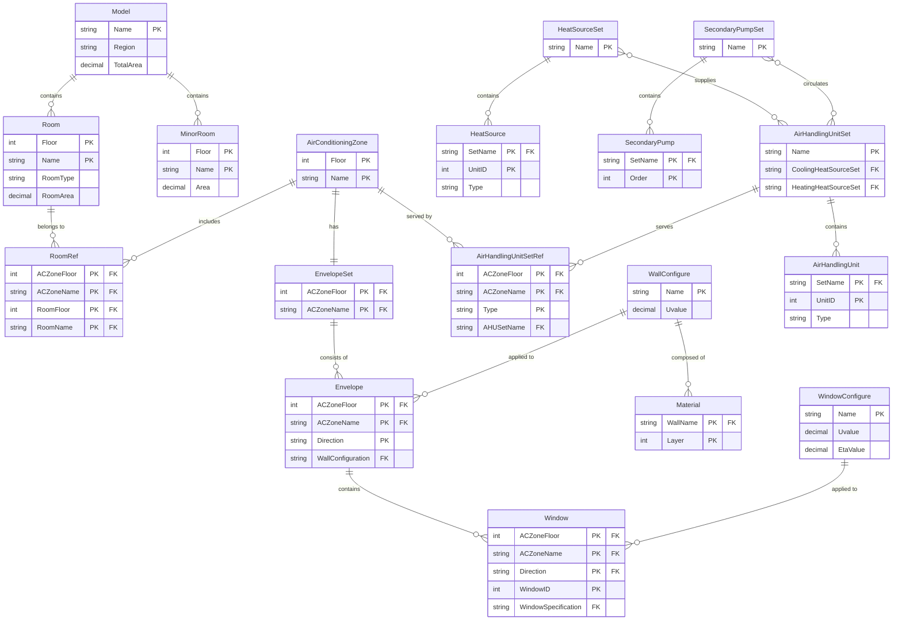
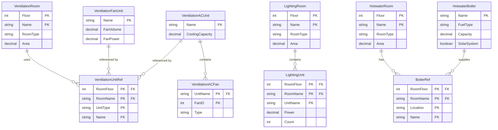
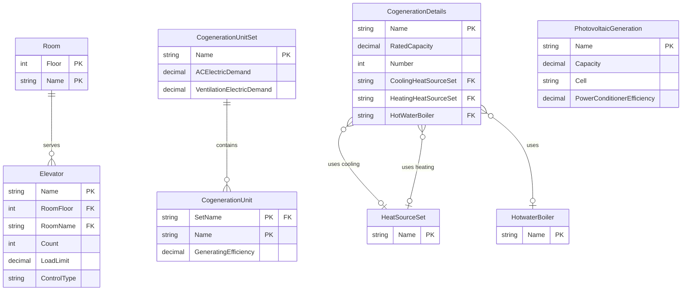
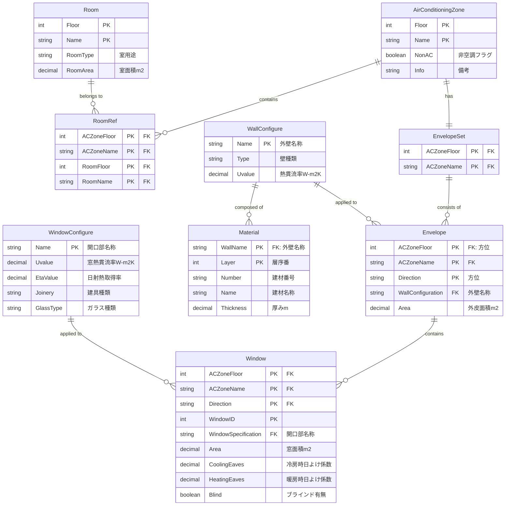
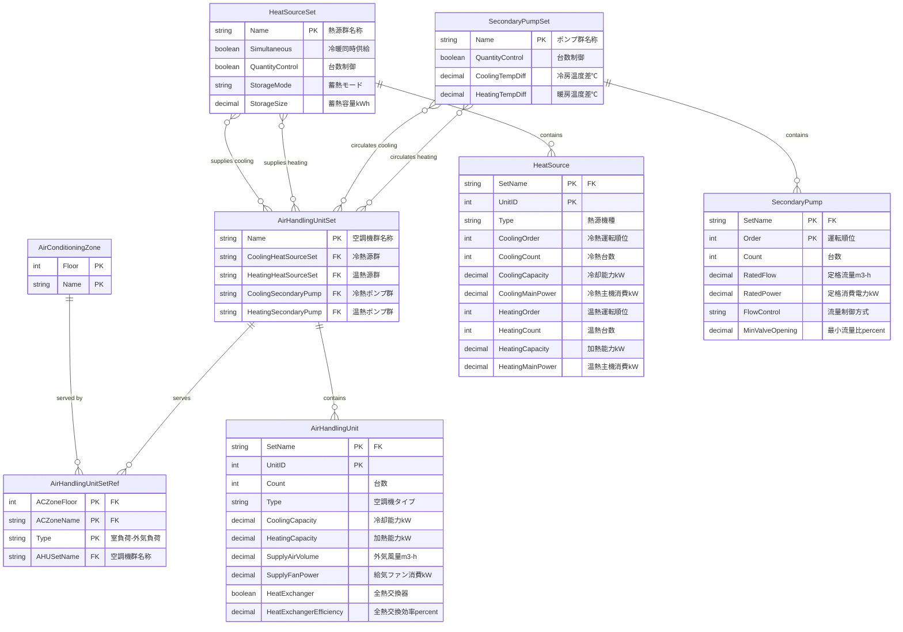
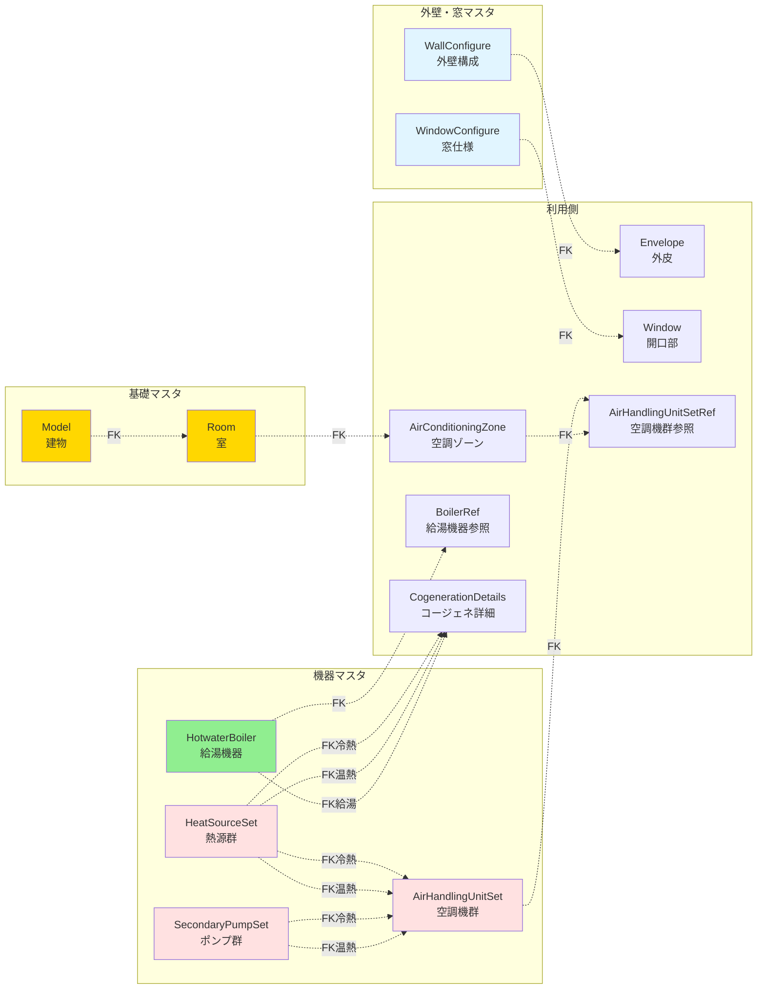
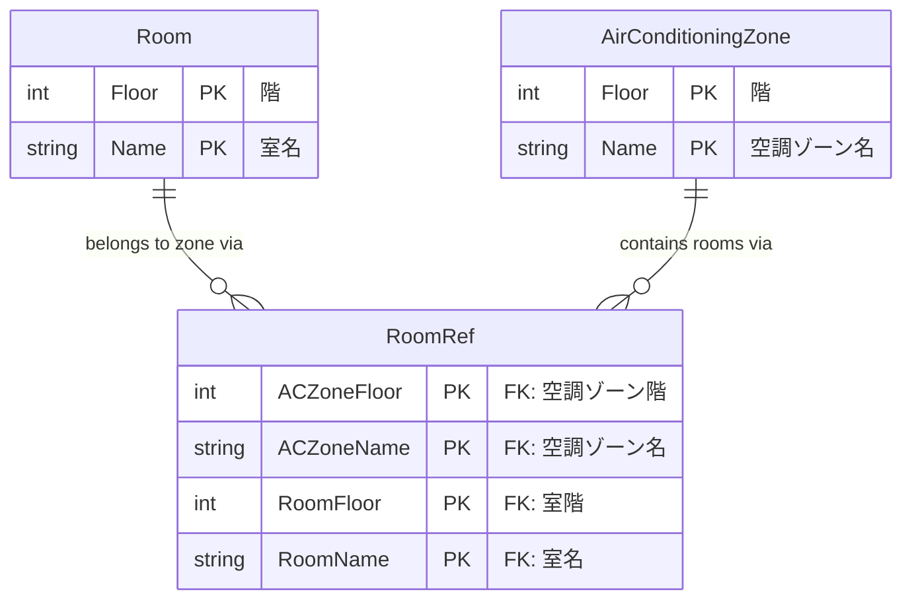
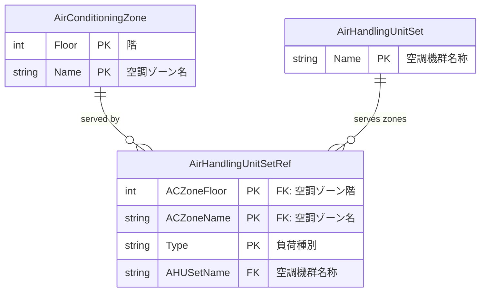
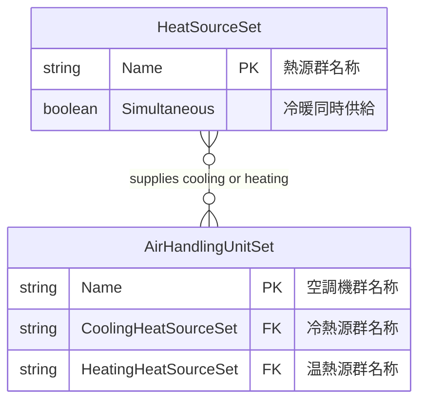
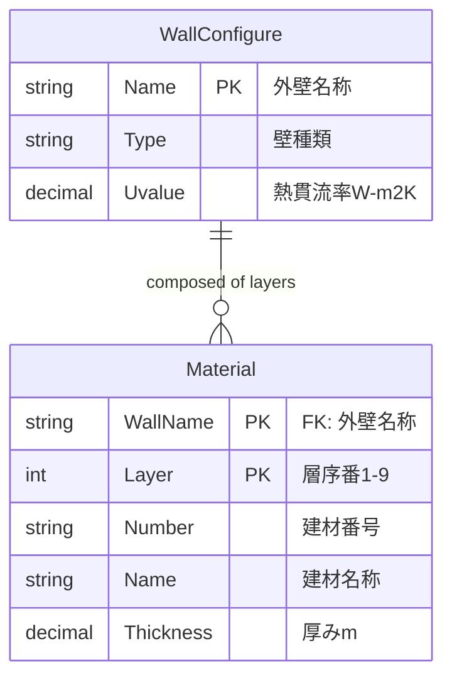

# エンティティ関係図(ER図)

## 1. 全体概要図(主要エンティティのみ)

### 1-1. 基本構造と空調システム



### 1-2. 換気・照明・給湯システム



### 1-3. その他設備(昇降機・発電・コージェネ)



## 2. 空調システムの詳細ER図

### 2-1. 空調ゾーンと外皮構成



### 2-2. 熱源・ポンプ・空調機の系統



## 3. エンティティのカーディナリティ

### 基本情報層

| 親エンティティ | 子エンティティ | カーディナリティ | 説明 |
|-------------|-------------|----------------|------|
| Model | Room | 1:N | 1建物に複数室 |
| Model | MinorRoom | 1:N | 1建物に複数非主要室 |

### 空調システム層

| 親エンティティ | 子エンティティ | カーディナリティ | 説明 |
|-------------|-------------|----------------|------|
| AirConditioningZone | RoomRef | 1:N | 1ゾーンに複数室 |
| Room | RoomRef | 1:N | 1室が複数ゾーンに所属可能 |
| AirConditioningZone | EnvelopeSet | 1:1 | 1ゾーンに1外皮仕様セット |
| EnvelopeSet | Envelope | 1:N | 1外皮仕様セットに複数方位 |
| Envelope | Window | 1:N | 1外皮に複数窓 |
| WallConfigure | Material | 1:N | 1外壁に複数建材層(最大9層) |
| WallConfigure | Envelope | 1:N | 1外壁仕様が複数外皮で使用 |
| WindowConfigure | Window | 1:N | 1窓仕様が複数開口部で使用 |
| HeatSourceSet | HeatSource | 1:N | 1熱源群に複数熱源機器 |
| SecondaryPumpSet | SecondaryPump | 1:N | 1ポンプ群に複数ポンプ |
| AirHandlingUnitSet | AirHandlingUnit | 1:N | 1空調機群に複数空調機 |
| HeatSourceSet | AirHandlingUnitSet | 1:N | 1熱源群が複数空調機群に供給 |
| SecondaryPumpSet | AirHandlingUnitSet | 1:N | 1ポンプ群が複数空調機群に供給 |
| AirHandlingUnitSet | AirHandlingUnitSetRef | 1:N | 1空調機群が複数ゾーンに供給 |
| AirConditioningZone | AirHandlingUnitSetRef | 1:N | 1ゾーンが複数空調機群を使用(室負荷/外気負荷) |

### 換気システム層

| 親エンティティ | 子エンティティ | カーディナリティ | 説明 |
|-------------|-------------|----------------|------|
| VentilationRoom | VentilationUnitRef | 1:N | 1換気対象室に複数換気機器 |
| VentilationACUnit | VentilationACFan | 1:N | 1換気代替空調機に複数送風機 |

### 照明システム層

| 親エンティティ | 子エンティティ | カーディナリティ | 説明 |
|-------------|-------------|----------------|------|
| LightingRoom | LightingUnit | 1:N | 1照明対象室に複数照明機器 |

### 給湯システム層

| 親エンティティ | 子エンティティ | カーディナリティ | 説明 |
|-------------|-------------|----------------|------|
| HotwaterRoom | BoilerRef | 1:N | 1給湯対象室に複数給湯箇所 |
| HotwaterBoiler | BoilerRef | 1:N | 1給湯機器が複数箇所で使用 |

### その他設備層

| 親エンティティ | 子エンティティ | カーディナリティ | 説明 |
|-------------|-------------|----------------|------|
| CogenerationUnitSet | CogenerationUnit | 1:N | 1コージェネシステムに複数機器 |
| HeatSourceSet | CogenerationDetails | 1:1 | コージェネが熱源群を利用 |
| HotwaterBoiler | CogenerationDetails | 1:1 | コージェネが給湯機器を利用 |

## 4. 主要な外部キー関係



## 5. エンティティのグループ化(7つの論理ビュー)

### ページ1: 基本情報・室仕様

- Model(基本情報)
- Room(室仕様)
- MinorRoom(非主要室)

**役割:** 建物と室の基本定義

### ページ2: 空調システム

- AirConditioningZone(空調ゾーン)
- RoomRef(室参照)
- HeatSourceSet / HeatSource(熱源群・熱源機器)
- SecondaryPumpSet / SecondaryPump(ポンプ群・ポンプ)
- AirHandlingUnitSet / AirHandlingUnit(空調機群・空調機)
- AirHandlingUnitSetRef(空調機群参照)

**役割:** 空調設備の機器構成と系統

### ページ3: 換気システム

- VentilationRoom(換気対象室)
- VentilationUnitRef(換気機器参照)
- VentilationFanUnit(給排気送風機)
- VentilationACUnit(換気代替空調機)
- VentilationACFan(換気代替空調機送風機)

**役割:** 換気設備の構成

### ページ4: 照明・給湯

- LightingRoom / LightingUnit(照明対象室・照明機器)
- HotwaterRoom / BoilerRef(給湯対象室・給湯機器参照)
- HotwaterBoiler(給湯機器)

**役割:** 照明・給湯設備の構成

### ページ5: 昇降機・発電

- Elevator(昇降機)
- PhotovoltaicGeneration(太陽光発電システム)

**役割:** 昇降機と太陽光発電の設備

### ページ6: コージェネ

- CogenerationUnitSet / CogenerationUnit(CASCADE用)
- CogenerationDetails(詳細仕様)

**役割:** コージェネレーション設備の構成

### ページ7: 外皮・外壁・窓

- WallConfigure / Material(外壁構成・建材層)
- WindowConfigure(窓仕様)
- EnvelopeSet / Envelope / Window(外皮仕様セット・外皮・開口部)

**役割:** 建物外皮の熱性能定義

## 6. 複雑なリレーションの詳細

### 6.1 空調ゾーンと室の多対多関係



**理由:**

- 理論上、1つの室が複数の空調ゾーンに含まれる可能性がある
- 実運用上は通常1室=1ゾーンだが、柔軟性を確保
- RoomRefテーブルで多対多関係を実現

**利点:**

- 将来的な拡張性(例:境界室が複数ゾーンにまたがる場合)
- データの整合性を維持
- クエリの柔軟性

### 6.2 空調ゾーンと空調機群の関係(Type区分)



**理由:**

- 1つの空調ゾーンは通常2種類の負荷処理を必要とする
  1. **室負荷処理** - 室内の冷暖房負荷
  2. **外気負荷処理** - 換気のための外気負荷
- 各負荷に対して異なる空調機群を割り当て可能
- Typeフィールド(PK)で用途を区別

**例:**

```text
ゾーン「1F事務室」の場合:
- Type="室負荷処理" → AHUSetName="AHU-1F-事務室"
- Type="外気負荷処理" → AHUSetName="外調機-1F"
```

### 6.3 熱源群と空調機群の関係(冷熱・温熱分離)



**理由:**

- 冷熱源と温熱源は物理的に異なる熱源群になる場合が多い
- 例:冷熱源=冷凍機、温熱源=ボイラー
- ただし同一熱源群が両方を供給するケースもある
  - 例:ヒートポンプ(冷暖切替)
  - この場合、CoolingHeatSourceSet = HeatingHeatSourceSet

**パターン:**

1. **別々の熱源群**
   - CoolingHeatSourceSet = "冷凍機群A"
   - HeatingHeatSourceSet = "ボイラー群B"

2. **同一熱源群**
   - CoolingHeatSourceSet = "ヒートポンプ群C"
   - HeatingHeatSourceSet = "ヒートポンプ群C"

3. **冷房のみ/暖房のみ**
   - CoolingHeatSourceSet = "冷凍機群A"
   - HeatingHeatSourceSet = NULL

### 6.4 外壁構成の複数層構造(最大9層)



**理由:**

- 建物外壁は通常、複数層の建材で構成される
- WEBPRO仕様では最大9層まで定義可能
- Layer(層序番)で外側から内側への順序を管理

**典型的な構成例:**

```text
外壁「RC壁+断熱材仕上げ」の場合:
Layer 1: コンクリート (200mm)
Layer 2: 断熱材 (50mm)
Layer 3: 石膏ボード (12.5mm)
```

**制約:**

- Layer は 1~9 の範囲
- 同じ外壁内で Layer は重複不可(主キー)
- 順序は外側(Layer=1)から内側(Layer=9)へ

## 7. データ整合性制約

### 主キー制約

- すべてのエンティティに主キー定義
- 複合主キーの場合、すべてのキー項目が必須(NOT NULL)

### 外部キー制約

- 参照先のエンティティに対応するレコードが存在する必要
- 例: AirHandlingUnitSet.CoolingHeatSourceSet → HeatSourceSet.Name

### ユニーク制約

- 主キー以外のユニーク制約は現在未定義
- 将来的に追加の可能性(例: 建物名のユニーク性)

### CHECK制約

- 数値範囲のチェック(面積 > 0、効率 0~1等)
- 列挙値のチェック(BuildingType、RoomType等)
- 論理整合性(冷房設定温度 < 暖房設定温度等)

## 8. インデックス戦略

### 現在定義されているインデックス(32個)

**主キーインデックス(自動作成):**
- すべてのエンティティの主キーに対して

**外部キーインデックス(推奨):**
- RoomRef.RoomFloor, RoomName
- Envelope.WallConfiguration
- Window.WindowSpecification
- AirHandlingUnit.SetName
- 等、すべての外部キーフィールド

**検索用インデックス:**
- Room.BuildingType, RoomType(用途別集計用)
- AirConditioningZone.Floor(階別集計用)

## 9. エンティティ数とデータボリューム見積もり

| エンティティ | 典型的なレコード数 | 説明 |
|----------|-----------------|------|
| Model | 1 | 1建物 |
| Room | 10~500 | 建物規模による |
| MinorRoom | 0~100 | 主要室入力法の場合 |
| AirConditioningZone | 10~100 | 用途・階ごと |
| RoomRef | 10~500 | Roomと同数 |
| WallConfigure | 5~30 | 外壁タイプ数 |
| Material | 15~270 | 外壁×最大9層 |
| WindowConfigure | 3~15 | 窓タイプ数 |
| EnvelopeSet | 10~100 | 空調ゾーンと同数 |
| Envelope | 50~800 | ゾーン×方位 |
| Window | 50~1000 | 外皮×窓数 |
| HeatSourceSet | 1~10 | 熱源系統数 |
| HeatSource | 2~30 | 熱源群×機器数 |
| SecondaryPumpSet | 1~10 | ポンプ系統数 |
| SecondaryPump | 2~30 | ポンプ群×台数 |
| AirHandlingUnitSet | 5~50 | 空調機系統数 |
| AirHandlingUnit | 10~200 | 空調機群×台数 |
| VentilationRoom | 5~100 | 換気対象室数 |
| VentilationFanUnit | 5~50 | 給排気送風機数 |
| VentilationACUnit | 0~10 | 換気代替空調機数 |
| LightingRoom | 10~500 | 照明対象室数 |
| LightingUnit | 20~1000 | 照明対象室×機器数 |
| HotwaterRoom | 5~100 | 給湯対象室数 |
| BoilerRef | 5~200 | 給湯対象室×箇所数 |
| HotwaterBoiler | 1~20 | 給湯機器数 |
| Elevator | 1~20 | 昇降機数 |
| PhotovoltaicGeneration | 0~5 | 太陽光発電システム数 |
| CogenerationUnitSet | 0~3 | コージェネシステム数 |
| CogenerationUnit | 0~10 | コージェネ機器数 |
| CogenerationDetails | 0~3 | コージェネ詳細数 |

**合計見積もり(中規模建物):**
- エンティティ数: 33
- レコード総数: 約1000~3000レコード
- XMLファイルサイズ: 約100~500KB

## 10. ER図の記法について

### Mermaid ER図の読み方

このドキュメントで使用しているMermaid ER図の記法を説明します。

#### リレーションシップの記法

```text
||--o{ : 1対多(1 to many)
||--|| : 1対1(1 to 1)
}o--o{ : 多対多(many to many)
}o--|| : 多対1(many to 1、オプショナル)
```

**カーディナリティの記号:**

- `||` : 必須(exactly one)
- `|o` : オプショナル(zero or one)
- `}o` : ゼロ以上(zero or more)
- `}{` : 1つ以上(one or more)

**例:**

```text
Model ||--o{ Room : "contains"
→ 1つのModelは0個以上のRoomを持つ(必須→オプショナル多)

AirConditioningZone ||--|| EnvelopeSet : "has"
→ 1つのAirConditioningZoneは必ず1つのEnvelopeSetを持つ(1対1必須)
```

#### 属性の記法

```text
エンティティ名 {
    データ型 フィールド名 制約 "説明"
}
```

**主キー/外部キーの表記:**

- `PK` : 主キー(Primary Key)
- `FK` : 外部キー(Foreign Key)
- `PK "FK"` : 主キーかつ外部キー(コメント内にFKと記載)

**例:**

```text
Room {
    int Floor PK "階"
    string Name PK "室名"
    string RoomType "室用途"
}
→ Floor と Name の複合主キー

RoomRef {
    int ACZoneFloor PK "FK"
    string ACZoneName PK "FK"
}
→ 主キーかつ外部キー(複合主キーの一部)
```

## 11. 全エンティティ一覧表

### 11-1. 基本情報層

| エンティティ | 物理名 | 主キー | 説明 |
| ------------ | ------ | ------ | ---- |
| 基本情報 | Model | Name | 建物の基本情報 |
| 室仕様 | Room | Floor, Name | 各室の詳細仕様 |
| 非主要室 | MinorRoom | Floor, Name | 主要室入力法での非主要室 |

### 11-2. 空調システム層

| エンティティ | 物理名 | 主キー | 説明 |
| ------------ | ------ | ------ | ---- |
| 空調ゾーン | AirConditioningZone | Floor, Name | 空調ゾーン定義 |
| 室参照 | RoomRef | ACZoneFloor, ACZoneName, RoomFloor, RoomName | 空調ゾーンと室の関連 |
| 空調機群参照 | AirHandlingUnitSetRef | ACZoneFloor, ACZoneName, Type | 空調ゾーンと空調機群の関連 |
| 熱源群 | HeatSourceSet | Name | 熱源機器のグループ |
| 熱源機器 | HeatSource | SetName, UnitID | 個別の熱源機器 |
| 二次ポンプ群 | SecondaryPumpSet | Name | 二次ポンプのグループ |
| 二次ポンプ | SecondaryPump | SetName, Order | 個別の二次ポンプ |
| 空調機群 | AirHandlingUnitSet | Name | 空調機のグループ |
| 空調機 | AirHandlingUnit | SetName, UnitID | 個別の空調機 |

### 11-3. 外皮層

| エンティティ | 物理名 | 主キー | 説明 |
| ------------ | ------ | ------ | ---- |
| 外壁構成 | WallConfigure | Name | 外壁の構成定義 |
| 建材層 | Material | WallName, Layer | 外壁を構成する建材(最大9層) |
| 窓仕様 | WindowConfigure | Name | 窓の仕様定義 |
| 外皮仕様セット | EnvelopeSet | ACZoneFloor, ACZoneName | 空調ゾーンごとの外皮仕様 |
| 外皮 | Envelope | ACZoneFloor, ACZoneName, Direction | 方位別の外皮定義 |
| 開口部 | Window | ACZoneFloor, ACZoneName, Direction, WindowID | 窓の詳細定義 |

### 11-4. 換気システム層

| エンティティ | 物理名 | 主キー | 説明 |
| ------------ | ------ | ------ | ---- |
| 換気対象室 | VentilationRoom | Floor, Name | 換気計算対象の室 |
| 換気機器参照 | VentilationUnitRef | RoomFloor, RoomName, UnitType | 換気対象室と機器の関連 |
| 給排気送風機 | VentilationFanUnit | Name | 給排気送風機の定義 |
| 換気代替空調機 | VentilationACUnit | Name | 換気代替空調機の定義 |
| 換気代替空調機送風機 | VentilationACFan | UnitName, FanID | 換気代替空調機の送風機 |

### 11-5. 照明システム層

| エンティティ | 物理名 | 主キー | 説明 |
| ------------ | ------ | ------ | ---- |
| 照明対象室 | LightingRoom | Floor, Name | 照明計算対象の室 |
| 照明機器 | LightingUnit | RoomFloor, RoomName, UnitName | 照明機器の定義 |

### 11-6. 給湯システム層

| エンティティ | 物理名 | 主キー | 説明 |
| ------------ | ------ | ------ | ---- |
| 給湯対象室 | HotwaterRoom | Floor, Name | 給湯計算対象の室 |
| 給湯機器参照 | BoilerRef | RoomFloor, RoomName, Location | 給湯対象室と機器の関連 |
| 給湯機器 | HotwaterBoiler | Name | 給湯機器の定義 |

### 11-7. その他設備層

| エンティティ | 物理名 | 主キー | 説明 |
| ------------ | ------ | ------ | ---- |
| 昇降機 | Elevator | Name | 昇降機の定義 |
| 太陽光発電システム | PhotovoltaicGeneration | Name | 太陽光発電システムの定義 |
| コージェネシステム | CogenerationUnitSet | Name | コージェネシステム(CASCADE用) |
| コージェネ機器 | CogenerationUnit | SetName, Name | コージェネ機器(CASCADE用) |
| コージェネ設備詳細 | CogenerationDetails | Name | コージェネ詳細仕様 |

## 12. まとめ

### エンティティ関係の特徴

Webpro入力データのエンティティ関係は以下の特徴を持ちます:

1. **階層構造**: Set(群)→ Unit(機器)の2階層が多い
2. **多対多関係**: 室と空調ゾーン、機器と対象室等
3. **外部キー参照**: 名前ベースの参照が主体
4. **複合主キー**: 階+名称、群名+ID等の組み合わせ
5. **論理ビュー**: 7つの視点(ページ)で整理
6. **拡張性**: 新規設備カテゴリの追加が容易
7. **整合性**: 厳密な制約で data quality を確保

### データモデルの設計方針

1. **正規化**: 第3正規形まで正規化し、データの冗長性を排除
2. **柔軟性**: 多対多関係を積極的に活用し、将来の拡張に対応
3. **命名規則**: 英語の物理名と日本語の論理名を併用
4. **制約管理**: 主キー、外部キー、CHECK制約で整合性を確保
5. **パフォーマンス**: 適切なインデックス設計でクエリ性能を最適化

### ER図の活用方法

このER図は以下の用途で活用できます:

- **開発者向け**: データベース設計、API設計の参考
- **入力担当者向け**: データ入力の流れと依存関係の理解
- **保守担当者向け**: データ整合性チェック、バグ調査の参考
- **新規機能開発**: 既存構造への影響分析、拡張ポイントの特定

### 改訂履歴

| 日付 | バージョン | 変更内容 |
| ---- | ---------- | -------- |
| 2026-01-12 | 2.0 | ER図を3つのセクションに分割、Mermaid形式で全面刷新 |
| 2025-XX-XX | 1.0 | 初版作成(33エンティティ定義) |
