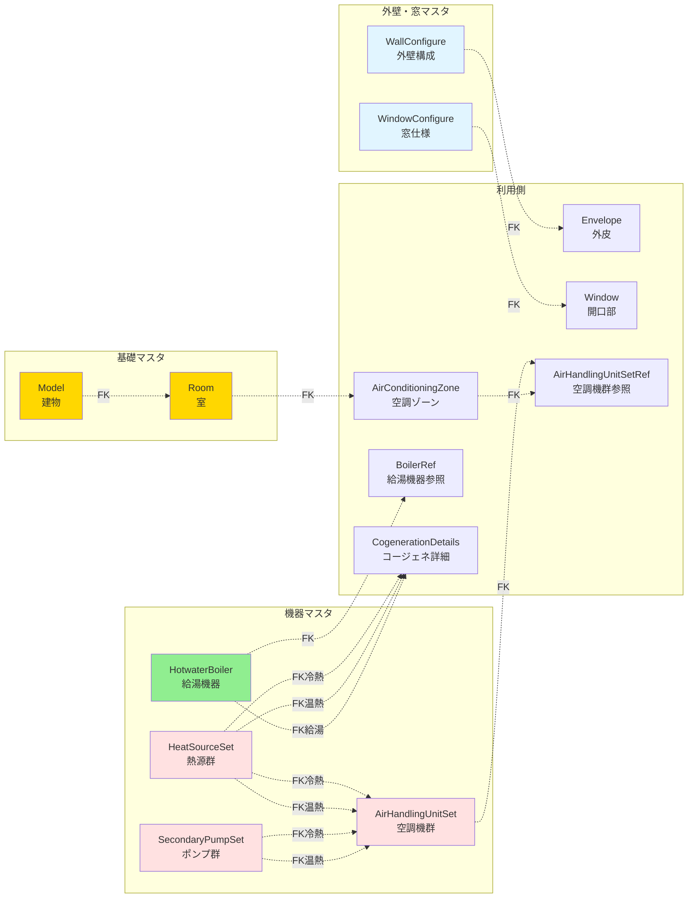
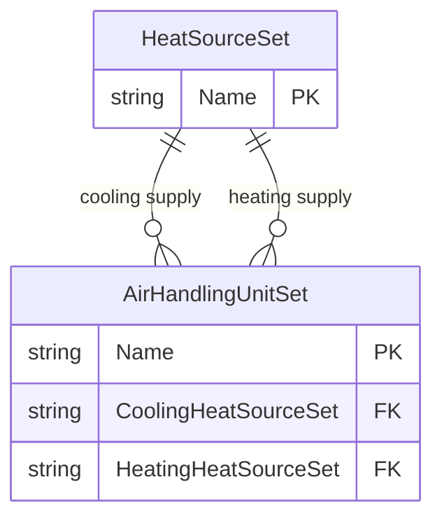

# エンティティ関係図（ER図）

## 1. 全体エンティティ関係図

```mermaid
erDiagram
    Model ||--o{ Room : "has"
    Model ||--o{ MinorRoom : "has"

    Room ||--o{ RoomRef : "referenced by"
    AirConditioningZone ||--o{ RoomRef : "contains"

    Room ||--o| VentilationRoom : "same"
    Room ||--o| LightingRoom : "same"
    Room ||--o| HotwaterRoom : "same"

    AirConditioningZone ||--o| EnvelopeSet : "has"
    AirConditioningZone ||--o{ AirHandlingUnitSetRef : "uses"

    EnvelopeSet ||--o{ Envelope : "has"
    Envelope ||--o{ Window : "has"

    WallConfigure ||--o{ Material : "composed of"
    WallConfigure ||--o{ Envelope : "used in"
    WindowConfigure ||--o{ Window : "used in"

    HeatSourceSet ||--o{ HeatSource : "contains"
    SecondaryPumpSet ||--o{ SecondaryPump : "contains"
    AirHandlingUnitSet ||--o{ AirHandlingUnit : "contains"

    HeatSourceSet ||--o{ AirHandlingUnitSet : "supplies cooling"
    HeatSourceSet ||--o{ AirHandlingUnitSet : "supplies heating"
    SecondaryPumpSet ||--o{ AirHandlingUnitSet : "pumps cooling"
    SecondaryPumpSet ||--o{ AirHandlingUnitSet : "pumps heating"

    AirHandlingUnitSet ||--o{ AirHandlingUnitSetRef : "referenced by"

    VentilationRoom ||--o{ VentilationUnitRef : "uses"
    VentilationACUnit ||--o{ VentilationACFan : "has"

    LightingRoom ||--o{ LightingUnit : "has"

    HotwaterRoom ||--o{ BoilerRef : "uses"
    HotwaterBoiler ||--o{ BoilerRef : "referenced by"

    CogenerationUnitSet ||--o{ CogenerationUnit : "contains"
    CogenerationDetails ||--o| HeatSourceSet : "uses for cooling"
    CogenerationDetails ||--o| HeatSourceSet : "uses for heating"
    CogenerationDetails ||--o| HotwaterBoiler : "uses"

    Model {
        string Name PK "建物名"
        date SheetCreateDate "シート作成月日"
        string PersonInCharge "入力責任者"
        string Region "地域区分"
        int GroundFloor "地上階数"
        int BasementFloor "地下階数"
        decimal TotalArea "延べ面積"
    }

    Room {
        int Floor PK "階"
        string Name PK "室名"
        string BuildingType "建物用途"
        string RoomType "室用途"
        decimal RoomArea "室面積"
        decimal FloorHeight "階高"
        boolean AirConditioning "空調対象"
        boolean Ventilation "換気対象"
        boolean Lighting "照明対象"
        boolean Hotwater "給湯対象"
    }

    AirConditioningZone {
        int Floor PK "階"
        string Name PK "ゾーン名"
        boolean NonAC "非空調フラグ"
    }

    WallConfigure {
        string Name PK "外壁名称"
        string Type "壁種類"
        decimal Uvalue "熱貫流率"
    }

    Material {
        string WallName PK FK "外壁名称"
        int Layer PK "層序番"
        string Number "建材番号"
        string Name "建材名称"
        decimal Thickness "厚み"
    }

    WindowConfigure {
        string Name PK "開口部名称"
        decimal Uvalue "窓熱貫流率"
        decimal EtaValue "日射熱取得率"
        string Joinery "建具種類"
        string GlassType "ガラス種類"
    }

    EnvelopeSet {
        int ACZoneFloor PK FK "階"
        string ACZoneName PK FK "ゾーン名"
    }

    Envelope {
        int ACZoneFloor PK FK "階"
        string ACZoneName PK FK "ゾーン名"
        string Direction PK "方位"
        string WallConfiguration FK "外壁名称"
        decimal Area "外皮面積"
    }

    Window {
        int ACZoneFloor PK FK "階"
        string ACZoneName PK FK "ゾーン名"
        string Direction PK FK "方位"
        int WindowID PK "窓ID"
        string WindowSpecification FK "開口部名称"
        decimal Area "窓面積"
        boolean Blind "ブラインド有無"
    }

    HeatSourceSet {
        string Name PK "熱源群名称"
        boolean Simultaneous "冷暖同時供給"
        boolean QuantityControl "台数制御"
        string StorageMode "蓄熱モード"
        decimal StorageSize "蓄熱容量"
    }

    HeatSource {
        string SetName PK FK "熱源群名称"
        int UnitID PK "機器ID"
        string Type "熱源機種"
        decimal CoolingCapacity "冷却能力"
        decimal HeatingCapacity "加熱能力"
    }

    SecondaryPumpSet {
        string Name PK "ポンプ群名称"
        boolean QuantityControl "台数制御"
        decimal CoolingTempDiff "冷房温度差"
        decimal HeatingTempDiff "暖房温度差"
    }

    SecondaryPump {
        string SetName PK FK "ポンプ群名称"
        int Order PK "運転順位"
        int Count "台数"
        decimal RatedFlow "定格流量"
        decimal RatedPower "定格消費電力"
        string FlowControl "流量制御方式"
    }

    AirHandlingUnitSet {
        string Name PK "空調機群名称"
        string CoolingHeatSourceSet FK "冷熱源群"
        string HeatingHeatSourceSet FK "温熱源群"
        string CoolingSecondaryPump FK "冷熱ポンプ群"
        string HeatingSecondaryPump FK "温熱ポンプ群"
    }

    AirHandlingUnit {
        string SetName PK FK "空調機群名称"
        int UnitID PK "機器ID"
        string Type "空調機タイプ"
        decimal CoolingCapacity "冷却能力"
        decimal HeatingCapacity "加熱能力"
        boolean HeatExchanger "全熱交有無"
    }

    VentilationRoom {
        int Floor PK "階"
        string Name PK "室名"
        string BuildingType "建物用途"
        string RoomType "室用途"
        decimal Area "室面積"
    }

    VentilationFanUnit {
        string Name PK "換気機器名称"
        decimal FanVolume "設計風量"
        decimal FanPower "電動機出力"
        string Motor "高効率電動機"
        boolean Inverter "インバータ"
    }

    VentilationACUnit {
        string Name PK "換気機器名称"
        string RoomType "対象室用途"
        decimal CoolingCapacity "冷却能力"
        decimal COP "熱源効率"
    }

    VentilationACFan {
        string UnitName PK FK "換気機器名称"
        int FanID PK "送風機ID"
        string Type "送風機種類"
        decimal Volume "設計風量"
    }

    LightingRoom {
        int Floor PK "階"
        string Name PK "室名"
        string BuildingType "建物用途"
        string RoomType "室用途"
        decimal Area "室面積"
        decimal RoomIndex "室指数"
    }

    LightingUnit {
        int RoomFloor PK FK "室階"
        string RoomName PK FK "室名"
        string UnitName PK "機器名称"
        decimal Power "定格消費電力"
        int Count "台数"
        string OccupantSensing "在室検知制御"
        string IlluminanceSensing "明るさ検知制御"
    }

    HotwaterRoom {
        int Floor PK "階"
        string Name PK "室名"
        string BuildingType "建物用途"
        string RoomType "室用途"
        decimal Area "室面積"
    }

    BoilerRef {
        int RoomFloor PK FK "室階"
        string RoomName PK FK "室名"
        string Location PK "給湯箇所"
        string WaterSaving "節湯器具"
        string Name FK "給湯機器名称"
    }

    HotwaterBoiler {
        string Name PK "給湯機器名称"
        string FuelType "燃料種類"
        decimal Capacity "定格加熱能力"
        decimal Efficiency "熱源効率"
        boolean SolarSystem "太陽熱利用"
        decimal SolarSystemArea "集熱面積"
    }

    Elevator {
        string Name PK "機器名称"
        int RoomFloor FK "対象室階"
        string RoomName FK "対象室名"
        int Count "台数"
        decimal LoadLimit "積載量"
        decimal Velocity "速度"
        string ControlType "速度制御方式"
        boolean Regeneration "電力回生"
    }

    PhotovoltaicGeneration {
        string Name PK "システム名称"
        decimal PowerConditionerEfficiency "PCE効率"
        string Cell "太陽電池種類"
        string Setup "アレイ設置方式"
        decimal Capacity "システム容量"
        decimal Direction "パネル方位角"
        decimal Angle "パネル傾斜角"
    }

    CogenerationUnitSet {
        string Name PK "システム名称"
        decimal ACElectricDemand "年間電力需要_空調"
        decimal VentilationElectricDemand "年間電力需要_換気"
        decimal LightingElectricDemand "年間電力需要_照明"
    }

    CogenerationUnit {
        string SetName PK FK "システム名称"
        string Name PK "機器名称"
        decimal GeneratingEfficiency "発電効率"
        decimal ExhaustHeatRecoveryRatio "排熱回収率"
    }

    CogenerationDetails {
        string Name PK "設備名称"
        decimal RatedCapacity "定格発電出力"
        int Number "設置台数"
        boolean Work24Hour "24時間運転"
        string CoolingHeatSourceSet FK "冷熱源"
        string HeatingHeatSourceSet FK "温熱源"
        string HotWaterBoiler FK "給湯機器"
    }

    MinorRoom {
        int Floor PK "階"
        string Name PK "室名"
        string BuildingType "建物用途"
        string RoomType "室用途(非主要室)"
        decimal Area "室面積"
    }
```

## 2. 空調システムの詳細ER図

```mermaid
erDiagram
    AirConditioningZone ||--o{ RoomRef : "contains"
    Room ||--o{ RoomRef : "referenced by"

    AirConditioningZone ||--o| EnvelopeSet : "has"
    EnvelopeSet ||--o{ Envelope : "has"
    Envelope ||--o{ Window : "has"

    Envelope }o--|| WallConfigure : "uses"
    WallConfigure ||--o{ Material : "composed of"
    Window }o--|| WindowConfigure : "uses"

    AirConditioningZone ||--o{ AirHandlingUnitSetRef : "uses"
    AirHandlingUnitSet ||--o{ AirHandlingUnitSetRef : "referenced by"

    AirHandlingUnitSet ||--o{ AirHandlingUnit : "contains"
    AirHandlingUnitSet }o--o| HeatSourceSet : "cooling source"
    AirHandlingUnitSet }o--o| HeatSourceSet : "heating source"
    AirHandlingUnitSet }o--o| SecondaryPumpSet : "cooling pump"
    AirHandlingUnitSet }o--o| SecondaryPumpSet : "heating pump"

    HeatSourceSet ||--o{ HeatSource : "contains"
    SecondaryPumpSet ||--o{ SecondaryPump : "contains"

    AirConditioningZone {
        int Floor PK
        string Name PK
        boolean NonAC
        string Info
    }

    RoomRef {
        int ACZoneFloor PK FK
        string ACZoneName PK FK
        int RoomFloor PK FK
        string RoomName PK FK
    }

    AirHandlingUnitSetRef {
        int ACZoneFloor PK FK
        string ACZoneName PK FK
        string Type PK
        string AHUSetName FK
    }

    EnvelopeSet {
        int ACZoneFloor PK FK
        string ACZoneName PK FK
    }

    Envelope {
        int ACZoneFloor PK FK
        string ACZoneName PK FK
        string Direction PK
        string WallConfiguration FK
        decimal Area
    }

    Window {
        int ACZoneFloor PK FK
        string ACZoneName PK FK
        string Direction PK FK
        int WindowID PK
        decimal CoolingEaves
        decimal HeatingEaves
        string WindowSpecification FK
        decimal Area
        boolean Blind
    }

    WallConfigure {
        string Name PK
        string Type
        decimal Uvalue
    }

    Material {
        string WallName PK FK
        int Layer PK
        string Number
        string Name
        decimal Thickness
        string Info
    }

    WindowConfigure {
        string Name PK
        decimal Uvalue
        decimal EtaValue
        string Joinery
        string GlassType
        decimal GlassUvalue
        decimal GlassEtaValue
        string Info
    }

    AirHandlingUnitSet {
        string Name PK
        string CoolingHeatSourceSet FK
        string HeatingHeatSourceSet FK
        string CoolingSecondaryPump FK
        string HeatingSecondaryPump FK
    }

    AirHandlingUnit {
        string SetName PK FK
        int UnitID PK
        int Count
        string Type
        decimal CoolingCapacity
        decimal HeatingCapacity
        decimal SupplyAirVolume
        decimal SupplyFanPower
        boolean HeatExchanger
        decimal HeatExchangerVolume
        decimal HeatExchangerEfficiency
        string Info
    }

    HeatSourceSet {
        string Name PK
        boolean Simultaneous
        boolean QuantityControl
        string StorageMode
        decimal StorageSize
    }

    HeatSource {
        string SetName PK FK
        int UnitID PK
        string Type
        int CoolingOrder
        int CoolingCount
        decimal CoolingSupplyWaterTemp
        decimal CoolingCapacity
        decimal CoolingMainPower
        int HeatingOrder
        int HeatingCount
        decimal HeatingSupplyWaterTemp
        decimal HeatingCapacity
        decimal HeatingMainPower
        string Info
    }

    SecondaryPumpSet {
        string Name PK
        boolean QuantityControl
        decimal CoolingTempDiff
        decimal HeatingTempDiff
    }

    SecondaryPump {
        string SetName PK FK
        int Order PK
        int Count
        decimal RatedFlow
        decimal RatedPower
        string FlowControl
        decimal MinValveOpening
        string Info
    }
```

## 3. エンティティのカーディナリティ

### 基本情報層

| 親エンティティ | 子エンティティ | カーディナリティ | 説明 |
|-------------|-------------|----------------|------|
| Model | Room | 1:N | 1建物に複数室 |
| Model | MinorRoom | 1:N | 1建物に複数非主要室 |

### 空調システム層

| 親エンティティ | 子エンティティ | カーディナリティ | 説明 |
|-------------|-------------|----------------|------|
| AirConditioningZone | RoomRef | 1:N | 1ゾーンに複数室 |
| Room | RoomRef | 1:N | 1室が複数ゾーンに所属可能 |
| AirConditioningZone | EnvelopeSet | 1:1 | 1ゾーンに1外皮仕様セット |
| EnvelopeSet | Envelope | 1:N | 1外皮仕様セットに複数方位 |
| Envelope | Window | 1:N | 1外皮に複数窓 |
| WallConfigure | Material | 1:N | 1外壁に複数建材層（最大9層） |
| WallConfigure | Envelope | 1:N | 1外壁仕様が複数外皮で使用 |
| WindowConfigure | Window | 1:N | 1窓仕様が複数開口部で使用 |
| HeatSourceSet | HeatSource | 1:N | 1熱源群に複数熱源機器 |
| SecondaryPumpSet | SecondaryPump | 1:N | 1ポンプ群に複数ポンプ |
| AirHandlingUnitSet | AirHandlingUnit | 1:N | 1空調機群に複数空調機 |
| HeatSourceSet | AirHandlingUnitSet | 1:N | 1熱源群が複数空調機群に供給 |
| SecondaryPumpSet | AirHandlingUnitSet | 1:N | 1ポンプ群が複数空調機群に供給 |
| AirHandlingUnitSet | AirHandlingUnitSetRef | 1:N | 1空調機群が複数ゾーンに供給 |
| AirConditioningZone | AirHandlingUnitSetRef | 1:N | 1ゾーンが複数空調機群を使用（室負荷/外気負荷） |

### 換気システム層

| 親エンティティ | 子エンティティ | カーディナリティ | 説明 |
|-------------|-------------|----------------|------|
| VentilationRoom | VentilationUnitRef | 1:N | 1換気対象室に複数換気機器 |
| VentilationACUnit | VentilationACFan | 1:N | 1換気代替空調機に複数送風機 |

### 照明システム層

| 親エンティティ | 子エンティティ | カーディナリティ | 説明 |
|-------------|-------------|----------------|------|
| LightingRoom | LightingUnit | 1:N | 1照明対象室に複数照明機器 |

### 給湯システム層

| 親エンティティ | 子エンティティ | カーディナリティ | 説明 |
|-------------|-------------|----------------|------|
| HotwaterRoom | BoilerRef | 1:N | 1給湯対象室に複数給湯箇所 |
| HotwaterBoiler | BoilerRef | 1:N | 1給湯機器が複数箇所で使用 |

### その他設備層

| 親エンティティ | 子エンティティ | カーディナリティ | 説明 |
|-------------|-------------|----------------|------|
| CogenerationUnitSet | CogenerationUnit | 1:N | 1コージェネシステムに複数機器 |
| HeatSourceSet | CogenerationDetails | 1:1 | コージェネが熱源群を利用 |
| HotwaterBoiler | CogenerationDetails | 1:1 | コージェネが給湯機器を利用 |

## 4. 主要な外部キー関係



## 5. エンティティのグループ化（7つの論理ビュー）

### ページ1: 基本情報・室仕様

- Model（基本情報）
- Room（室仕様）
- MinorRoom（非主要室）

**役割:** 建物と室の基本定義

### ページ2: 空調システム

- AirConditioningZone（空調ゾーン）
- RoomRef（室参照）
- HeatSourceSet / HeatSource（熱源群・熱源機器）
- SecondaryPumpSet / SecondaryPump（ポンプ群・ポンプ）
- AirHandlingUnitSet / AirHandlingUnit（空調機群・空調機）
- AirHandlingUnitSetRef（空調機群参照）

**役割:** 空調設備の機器構成と系統

### ページ3: 換気システム

- VentilationRoom（換気対象室）
- VentilationUnitRef（換気機器参照）
- VentilationFanUnit（給排気送風機）
- VentilationACUnit（換気代替空調機）
- VentilationACFan（換気代替空調機送風機）

**役割:** 換気設備の構成

### ページ4: 照明・給湯

- LightingRoom / LightingUnit（照明対象室・照明機器）
- HotwaterRoom / BoilerRef（給湯対象室・給湯機器参照）
- HotwaterBoiler（給湯機器）

**役割:** 照明・給湯設備の構成

### ページ5: 昇降機・発電

- Elevator（昇降機）
- PhotovoltaicGeneration（太陽光発電システム）

**役割:** 昇降機と太陽光発電の設備

### ページ6: コージェネ

- CogenerationUnitSet / CogenerationUnit（CASCADE用）
- CogenerationDetails（詳細仕様）

**役割:** コージェネレーション設備の構成

### ページ7: 外皮・外壁・窓

- WallConfigure / Material（外壁構成・建材層）
- WindowConfigure（窓仕様）
- EnvelopeSet / Envelope / Window（外皮仕様セット・外皮・開口部）

**役割:** 建物外皮の熱性能定義

## 6. 複雑なリレーションの詳細

### 6.1 空調ゾーンと室の多対多関係

```mermaid
erDiagram
    Room ||--o{ RoomRef : "referenced"
    AirConditioningZone ||--o{ RoomRef : "contains"

    Room {
        int Floor PK
        string Name PK
    }

    AirConditioningZone {
        int Floor PK
        string Name PK
    }

    RoomRef {
        int ACZoneFloor PK FK
        string ACZoneName PK FK
        int RoomFloor PK FK
        string RoomName PK FK
    }
```

**理由:**
- 1つの室が複数の空調ゾーンに含まれることはない（実運用上）
- しかし論理的には多対多を許容
- RoomRefテーブルで中間テーブル化

### 6.2 空調ゾーンと空調機群の関係

```mermaid
erDiagram
    AirConditioningZone ||--o{ AirHandlingUnitSetRef : "uses"
    AirHandlingUnitSet ||--o{ AirHandlingUnitSetRef : "serves"

    AirConditioningZone {
        int Floor PK
        string Name PK
    }

    AirHandlingUnitSet {
        string Name PK
    }

    AirHandlingUnitSetRef {
        int ACZoneFloor PK FK
        string ACZoneName PK FK
        string Type PK
        string AHUSetName FK
    }
```

**理由:**
- 1つの空調ゾーンは「室負荷処理用」と「外気負荷処理用」の2つの空調機群を持つ可能性
- Typeフィールドで区別

### 6.3 熱源群と空調機群の関係



**理由:**
- 冷熱源と温熱源は別々の熱源群の場合がある
- 同一の熱源群が冷熱・温熱両方を供給する場合もある

### 6.4 外壁構成の複数層構造

```mermaid
erDiagram
    WallConfigure ||--o{ Material : "composed of"

    WallConfigure {
        string Name PK
        string Type
        decimal Uvalue
    }

    Material {
        string WallName PK FK
        int Layer PK
        string Number
        string Name
        decimal Thickness
    }
```

**理由:**
- 1つの外壁は最大9層の建材から構成
- Layerフィールドで順序を管理

## 7. データ整合性制約

### 主キー制約

- すべてのエンティティに主キー定義
- 複合主キーの場合、すべてのキー項目が必須（NOT NULL）

### 外部キー制約

- 参照先のエンティティに対応するレコードが存在する必要
- 例: AirHandlingUnitSet.CoolingHeatSourceSet → HeatSourceSet.Name

### ユニーク制約

- 主キー以外のユニーク制約は現在未定義
- 将来的に追加の可能性（例: 建物名のユニーク性）

### CHECK制約

- 数値範囲のチェック（面積 > 0、効率 0～1等）
- 列挙値のチェック（BuildingType、RoomType等）
- 論理整合性（冷房設定温度 < 暖房設定温度等）

## 8. インデックス戦略

### 現在定義されているインデックス（32個）

**主キーインデックス（自動作成）:**
- すべてのエンティティの主キーに対して

**外部キーインデックス（推奨）:**
- RoomRef.RoomFloor, RoomName
- Envelope.WallConfiguration
- Window.WindowSpecification
- AirHandlingUnit.SetName
- 等、すべての外部キーフィールド

**検索用インデックス:**
- Room.BuildingType, RoomType（用途別集計用）
- AirConditioningZone.Floor（階別集計用）

## 9. エンティティ数とデータボリューム見積もり

| エンティティ | 典型的なレコード数 | 説明 |
|----------|-----------------|------|
| Model | 1 | 1建物 |
| Room | 10～500 | 建物規模による |
| MinorRoom | 0～100 | 主要室入力法の場合 |
| AirConditioningZone | 10～100 | 用途・階ごと |
| RoomRef | 10～500 | Roomと同数 |
| WallConfigure | 5～30 | 外壁タイプ数 |
| Material | 15～270 | 外壁×最大9層 |
| WindowConfigure | 3～15 | 窓タイプ数 |
| EnvelopeSet | 10～100 | 空調ゾーンと同数 |
| Envelope | 50～800 | ゾーン×方位 |
| Window | 50～1000 | 外皮×窓数 |
| HeatSourceSet | 1～10 | 熱源系統数 |
| HeatSource | 2～30 | 熱源群×機器数 |
| SecondaryPumpSet | 1～10 | ポンプ系統数 |
| SecondaryPump | 2～30 | ポンプ群×台数 |
| AirHandlingUnitSet | 5～50 | 空調機系統数 |
| AirHandlingUnit | 10～200 | 空調機群×台数 |
| VentilationRoom | 5～100 | 換気対象室数 |
| VentilationFanUnit | 5～50 | 給排気送風機数 |
| VentilationACUnit | 0～10 | 換気代替空調機数 |
| LightingRoom | 10～500 | 照明対象室数 |
| LightingUnit | 20～1000 | 照明対象室×機器数 |
| HotwaterRoom | 5～100 | 給湯対象室数 |
| BoilerRef | 5～200 | 給湯対象室×箇所数 |
| HotwaterBoiler | 1～20 | 給湯機器数 |
| Elevator | 1～20 | 昇降機数 |
| PhotovoltaicGeneration | 0～5 | 太陽光発電システム数 |
| CogenerationUnitSet | 0～3 | コージェネシステム数 |
| CogenerationUnit | 0～10 | コージェネ機器数 |
| CogenerationDetails | 0～3 | コージェネ詳細数 |

**合計見積もり（中規模建物）:**
- エンティティ数: 33
- レコード総数: 約1000～3000レコード
- XMLファイルサイズ: 約100～500KB

## 10. まとめ

Webpro入力データのエンティティ関係は以下の特徴を持ちます：

1. **階層構造**: Set（群）→ Unit（機器）の2階層が多い
2. **多対多関係**: 室と空調ゾーン、機器と対象室等
3. **外部キー参照**: 名前ベースの参照が主体
4. **複合主キー**: 階+名称、群名+ID等の組み合わせ
5. **論理ビュー**: 7つの視点で整理
6. **拡張性**: 新規設備カテゴリの追加が容易
7. **整合性**: 厳密な制約で data quality を確保
