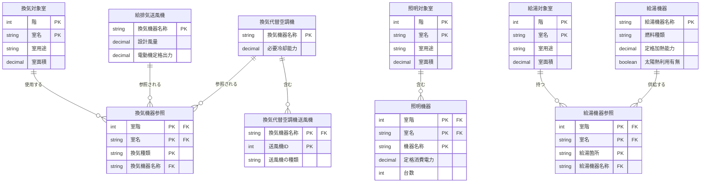

# エンティティ関係図(ER図) - 日本語版

> **実際のシート入力作業者向け**: このドキュメントは、WEBPRO入力シートの各項目がどのように関連しているかを、日本語で分かりやすく示したものです。

## 1. 全体概要図(主要なデータ項目のみ)

### 1-1. 基本構造と空調システム


### 1-2. 換気・照明・給湯システム



### 1-3. その他設備(昇降機・発電・コージェネ)


## 2. 空調システムの詳細ER図

### 2-1. 空調ゾーンと外皮構成


### 2-2. 熱源・ポンプ・空調機の系統


## 3. エンティティのカーディナリティ(関係の種類)

### 基本情報層

| 親エンティティ | 子エンティティ | カーディナリティ | 説明 |
|-------------|-------------|----------------|------|
| 基本情報 | 室仕様 | 1:N | 1つの建物に複数の室 |
| 基本情報 | 非主要室 | 1:N | 1つの建物に複数の非主要室 |

### 空調システム層

| 親エンティティ | 子エンティティ | カーディナリティ | 説明 |
|-------------|-------------|----------------|------|
| 空調ゾーン | 室参照 | 1:N | 1つの空調ゾーンに複数の室 |
| 室仕様 | 室参照 | 1:N | 1つの室が複数のゾーンに所属可能 |
| 空調ゾーン | 外皮仕様セット | 1:1 | 1つの空調ゾーンに1つの外皮仕様 |
| 外皮仕様セット | 外皮 | 1:N | 1つの外皮仕様に複数の方位 |
| 外皮 | 開口部 | 1:N | 1つの外皮に複数の窓 |
| 外壁構成 | 建材層 | 1:N | 1つの外壁に複数の建材層(最大9層) |
| 外壁構成 | 外皮 | 1:N | 1つの外壁仕様が複数の外皮で使用 |
| 窓仕様 | 開口部 | 1:N | 1つの窓仕様が複数の開口部で使用 |
| 熱源群 | 熱源機器 | 1:N | 1つの熱源群に複数の熱源機器 |
| 二次ポンプ群 | 二次ポンプ | 1:N | 1つのポンプ群に複数のポンプ |
| 空調機群 | 空調機 | 1:N | 1つの空調機群に複数の空調機 |
| 熱源群 | 空調機群 | M:N | 1つの熱源群が複数の空調機群に供給 |
| 二次ポンプ群 | 空調機群 | M:N | 1つのポンプ群が複数の空調機群に供給 |
| 空調機群 | 空調機群参照 | 1:N | 1つの空調機群が複数のゾーンに供給 |
| 空調ゾーン | 空調機群参照 | 1:N | 1つのゾーンが複数の空調機群を使用 |

### 換気システム層

| 親エンティティ | 子エンティティ | カーディナリティ | 説明 |
|-------------|-------------|----------------|------|
| 換気対象室 | 換気機器参照 | 1:N | 1つの換気対象室に複数の換気機器 |
| 換気代替空調機 | 換気代替空調機送風機 | 1:N | 1つの換気代替空調機に複数の送風機 |

### 照明システム層

| 親エンティティ | 子エンティティ | カーディナリティ | 説明 |
|-------------|-------------|----------------|------|
| 照明対象室 | 照明機器 | 1:N | 1つの照明対象室に複数の照明機器 |

### 給湯システム層

| 親エンティティ | 子エンティティ | カーディナリティ | 説明 |
|-------------|-------------|----------------|------|
| 給湯対象室 | 給湯機器参照 | 1:N | 1つの給湯対象室に複数の給湯箇所 |
| 給湯機器 | 給湯機器参照 | 1:N | 1つの給湯機器が複数箇所で使用 |

### その他設備層

| 親エンティティ | 子エンティティ | カーディナリティ | 説明 |
|-------------|-------------|----------------|------|
| コージェネシステム | コージェネ機器 | 1:N | 1つのコージェネシステムに複数の機器 |
| 熱源群 | コージェネ設備詳細 | 1:1 | コージェネが熱源群を利用 |
| 給湯機器 | コージェネ設備詳細 | 1:1 | コージェネが給湯機器を利用 |

## 4. WEBPRO入力シートとの対応表

このセクションでは、実際のWEBPRO入力シートの様式番号とER図のエンティティの対応関係を示します。

| 様式番号 | シート名 | エンティティ名 | 説明 |
|---------|---------|-------------|------|
| 様式0 | 基本情報入力シート | 基本情報 | 建物全体の基本情報 |
| 様式1 | 室仕様入力シート | 室仕様 | 各室の詳細仕様 |
| 様式1 | 室仕様入力シート | 非主要室 | 主要室入力法での非主要室 |
| 様式2-1 | 空調ゾーン入力シート | 空調ゾーン | 空調ゾーンの定義 |
| 様式2-1 | 空調ゾーン入力シート | 室参照 | 空調ゾーンと室の関連 |
| 様式2-2 | 外壁構成入力シート | 外壁構成 | 外壁の構成定義 |
| 様式2-2 | 外壁構成入力シート | 建材層 | 外壁を構成する建材(最大9層) |
| 様式2-3 | 窓仕様入力シート | 窓仕様 | 窓の仕様定義 |
| 様式2-4 | 外皮仕様入力シート | 外皮仕様セット | 空調ゾーンごとの外皮仕様 |
| 様式2-4 | 外皮仕様入力シート | 外皮 | 方位別の外皮定義 |
| 様式2-4 | 外皮仕様入力シート | 開口部 | 窓の詳細定義 |
| 様式2-5 | 熱源入力シート | 熱源群 | 熱源機器のグループ |
| 様式2-5 | 熱源入力シート | 熱源機器 | 個別の熱源機器 |
| 様式2-6 | 二次ポンプ入力シート | 二次ポンプ群 | 二次ポンプのグループ |
| 様式2-6 | 二次ポンプ入力シート | 二次ポンプ | 個別の二次ポンプ |
| 様式2-7 | 空調機入力シート | 空調機群 | 空調機のグループ |
| 様式2-7 | 空調機入力シート | 空調機 | 個別の空調機 |
| 様式2-7 | 空調機入力シート | 空調機群参照 | 空調ゾーンと空調機群の関連 |
| 様式3-1 | 換気対象室入力シート | 換気対象室 | 換気計算対象の室 |
| 様式3-1 | 換気対象室入力シート | 換気機器参照 | 換気対象室と機器の関連 |
| 様式3-2 | 給排気送風機入力シート | 給排気送風機 | 給排気送風機の定義 |
| 様式3-3 | 換気代替空調機入力シート | 換気代替空調機 | 換気代替空調機の定義 |
| 様式3-3 | 換気代替空調機入力シート | 換気代替空調機送風機 | 換気代替空調機の送風機 |
| 様式4 | 照明入力シート | 照明対象室 | 照明計算対象の室 |
| 様式4 | 照明入力シート | 照明機器 | 照明機器の定義 |
| 様式5-1 | 給湯対象室入力シート | 給湯対象室 | 給湯計算対象の室 |
| 様式5-1 | 給湯対象室入力シート | 給湯機器参照 | 給湯対象室と機器の関連 |
| 様式5-2 | 給湯機器入力シート | 給湯機器 | 給湯機器の定義 |
| 様式6 | 昇降機入力シート | 昇降機 | 昇降機の定義 |
| 様式7-1 | 太陽光発電システム入力シート | 太陽光発電システム | 太陽光発電システムの定義 |
| 様式7-2 | コージェネレーション設備入力シート | コージェネシステム | コージェネシステム(CASCADE用) |
| 様式7-2 | コージェネレーション設備入力シート | コージェネ機器 | コージェネ機器(CASCADE用) |
| 様式7-3 | コージェネレーション設備詳細入力シート | コージェネ設備詳細 | コージェネ詳細仕様 |

## 5. ER図の記法について

### Mermaid ER図の読み方

このドキュメントで使用しているMermaid ER図の記法を説明します。

#### リレーションシップの記法

```text
||--o{ : 1対多(1つの親に対して0個以上の子)
||--|| : 1対1(1つの親に対して必ず1つの子)
}o--o{ : 多対多(複数の親に対して複数の子)
```

**カーディナリティの記号:**

- `||` : 必須(必ず1つ)
- `|o` : オプショナル(0個または1つ)
- `}o` : ゼロ以上(0個以上)
- `}{` : 1つ以上(必ず1つ以上)

**例:**

```text
基本情報 ||--o{ 室仕様 : "含む"
→ 1つの基本情報は0個以上の室仕様を持つ

空調ゾーン ||--|| 外皮仕様セット : "持つ"
→ 1つの空調ゾーンは必ず1つの外皮仕様セットを持つ
```

#### 属性の記法

```text
エンティティ名 {
    データ型 項目名 制約 "説明"
}
```

**主キー/外部キーの表記:**

- `PK` : 主キー(このエンティティを一意に識別する項目)
- `FK` : 外部キー(他のエンティティを参照する項目)
- `PK "FK"` : 主キーかつ外部キー(コメント内にFKと記載)

**例:**

```text
室仕様 {
    int 階 PK
    string 室名 PK
    string 室用途
}
→ 階と室名の複合主キー(2つの項目で室を一意に識別)

室参照 {
    int 空調ゾーン階 PK "FK"
    string 空調ゾーン名 PK "FK"
}
→ 主キーかつ外部キー(他のエンティティを参照しつつ、このエンティティの主キーでもある)
```

## 6. 全エンティティ一覧表

### 6-1. 基本情報層

| エンティティ | 様式番号 | 主キー | 説明 |
| ------------ | -------- | ------ | ---- |
| 基本情報 | 様式0 | 建物の名称 | 建物の基本情報 |
| 室仕様 | 様式1 | 階, 室名 | 各室の詳細仕様 |
| 非主要室 | 様式1 | 階, 室名 | 主要室入力法での非主要室 |

### 6-2. 空調システム層

| エンティティ | 様式番号 | 主キー | 説明 |
| ------------ | -------- | ------ | ---- |
| 空調ゾーン | 様式2-1 | 階, 空調ゾーン名 | 空調ゾーン定義 |
| 室参照 | 様式2-1 | 空調ゾーン階, 空調ゾーン名, 室階, 室名 | 空調ゾーンと室の関連 |
| 空調機群参照 | 様式2-7 | 空調ゾーン階, 空調ゾーン名, 負荷種別 | 空調ゾーンと空調機群の関連 |
| 熱源群 | 様式2-5 | 熱源群名称 | 熱源機器のグループ |
| 熱源機器 | 様式2-5 | 熱源群名称, 機器ID | 個別の熱源機器 |
| 二次ポンプ群 | 様式2-6 | 二次ポンプ群名称 | 二次ポンプのグループ |
| 二次ポンプ | 様式2-6 | 二次ポンプ群名称, 運転順位 | 個別の二次ポンプ |
| 空調機群 | 様式2-7 | 空調機群名称 | 空調機のグループ |
| 空調機 | 様式2-7 | 空調機群名称, 機器ID | 個別の空調機 |

### 6-3. 外皮層

| エンティティ | 様式番号 | 主キー | 説明 |
| ------------ | -------- | ------ | ---- |
| 外壁構成 | 様式2-2 | 外壁名称 | 外壁の構成定義 |
| 建材層 | 様式2-2 | 外壁名称, 層序番 | 外壁を構成する建材(最大9層) |
| 窓仕様 | 様式2-3 | 開口部名称 | 窓の仕様定義 |
| 外皮仕様セット | 様式2-4 | 空調ゾーン階, 空調ゾーン名 | 空調ゾーンごとの外皮仕様 |
| 外皮 | 様式2-4 | 空調ゾーン階, 空調ゾーン名, 方位 | 方位別の外皮定義 |
| 開口部 | 様式2-4 | 空調ゾーン階, 空調ゾーン名, 方位, 窓ID | 窓の詳細定義 |

### 6-4. 換気システム層

| エンティティ | 様式番号 | 主キー | 説明 |
| ------------ | -------- | ------ | ---- |
| 換気対象室 | 様式3-1 | 階, 室名 | 換気計算対象の室 |
| 換気機器参照 | 様式3-1 | 室階, 室名, 換気種類 | 換気対象室と機器の関連 |
| 給排気送風機 | 様式3-2 | 換気機器名称 | 給排気送風機の定義 |
| 換気代替空調機 | 様式3-3 | 換気機器名称 | 換気代替空調機の定義 |
| 換気代替空調機送風機 | 様式3-3 | 換気機器名称, 送風機ID | 換気代替空調機の送風機 |

### 6-5. 照明システム層

| エンティティ | 様式番号 | 主キー | 説明 |
| ------------ | -------- | ------ | ---- |
| 照明対象室 | 様式4 | 階, 室名 | 照明計算対象の室 |
| 照明機器 | 様式4 | 室階, 室名, 機器名称 | 照明機器の定義 |

### 6-6. 給湯システム層

| エンティティ | 様式番号 | 主キー | 説明 |
| ------------ | -------- | ------ | ---- |
| 給湯対象室 | 様式5-1 | 階, 室名 | 給湯計算対象の室 |
| 給湯機器参照 | 様式5-1 | 室階, 室名, 給湯箇所 | 給湯対象室と機器の関連 |
| 給湯機器 | 様式5-2 | 給湯機器名称 | 給湯機器の定義 |

### 6-7. その他設備層

| エンティティ | 様式番号 | 主キー | 説明 |
| ------------ | -------- | ------ | ---- |
| 昇降機 | 様式6 | 機器名称 | 昇降機の定義 |
| 太陽光発電システム | 様式7-1 | 太陽光発電システム名称 | 太陽光発電システムの定義 |
| コージェネシステム | 様式7-2 | コージェネレーションシステム名称 | コージェネシステム(CASCADE用) |
| コージェネ機器 | 様式7-2 | コージェネレーションシステム名称, 機器名称 | コージェネ機器(CASCADE用) |
| コージェネ設備詳細 | 様式7-3 | コージェネレーション設備名称 | コージェネ詳細仕様 |

## 7. データ入力時の注意事項

### 7.1 主キーの重要性

**主キー**とは、各データを一意に識別するための項目です。例えば:

- **室仕様**の主キーは「階」と「室名」の組み合わせ
  - 「3F」+「会議室A」で一意に識別
  - 同じ階に同じ室名は登録できません

- **熱源機器**の主キーは「熱源群名称」と「機器ID」の組み合わせ
  - 「熱源群A」+「1」で一意に識別
  - 同じ熱源群に同じ機器IDは登録できません

### 7.2 外部キーの関連性

**外部キー**とは、他のデータを参照する項目です。例えば:

- **外皮**の「外壁名称」は、**外壁構成**の「外壁名称」を参照
  - 外皮を入力する前に、外壁構成を先に登録する必要があります

- **空調機群**の「冷熱源群名称」は、**熱源群**の「熱源群名称」を参照
  - 空調機群を入力する前に、熱源群を先に登録する必要があります

### 7.3 入力順序の推奨

データの依存関係を考慮した推奨入力順序:

1. **基本情報** (様式0)
2. **室仕様** (様式1)
3. **外壁構成・建材層** (様式2-2) → **窓仕様** (様式2-3)
4. **空調ゾーン・室参照** (様式2-1)
5. **外皮仕様セット・外皮・開口部** (様式2-4)
6. **熱源群・熱源機器** (様式2-5)
7. **二次ポンプ群・二次ポンプ** (様式2-6)
8. **空調機群・空調機・空調機群参照** (様式2-7)
9. **換気・照明・給湯** (様式3, 4, 5)
10. **その他設備** (様式6, 7)

## 8. まとめ

### エンティティ関係の特徴

WEBPRO入力データのエンティティ関係は以下の特徴を持ちます:

1. **階層構造**: 群(グループ)→機器の2階層構造が多い
2. **多対多関係**: 室と空調ゾーン、機器と対象室など
3. **名前ベースの参照**: 名称を使った外部キー参照が主体
4. **複合主キー**: 階+名称、群名+IDなどの組み合わせ
5. **様式単位の整理**: 7つの入力シート群で整理
6. **拡張性**: 新規設備カテゴリの追加が容易
7. **整合性**: 厳密な制約でデータ品質を確保

### このER図の活用方法

このER図は以下の用途で活用できます:

- **入力担当者向け**: データ入力の流れと依存関係の理解
- **チェック担当者向け**: データ整合性チェック、エラー調査の参考
- **システム担当者向け**: データベース設計、API設計の参考
- **新規機能開発**: 既存構造への影響分析、拡張ポイントの特定

### 改訂履歴

| 日付 | バージョン | 変更内容 |
| ---- | ---------- | -------- |
| 2026-01-13 | 1.0 | 日本語版ER図を新規作成 |
