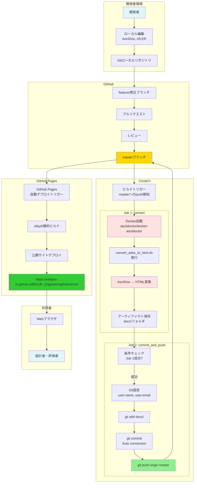
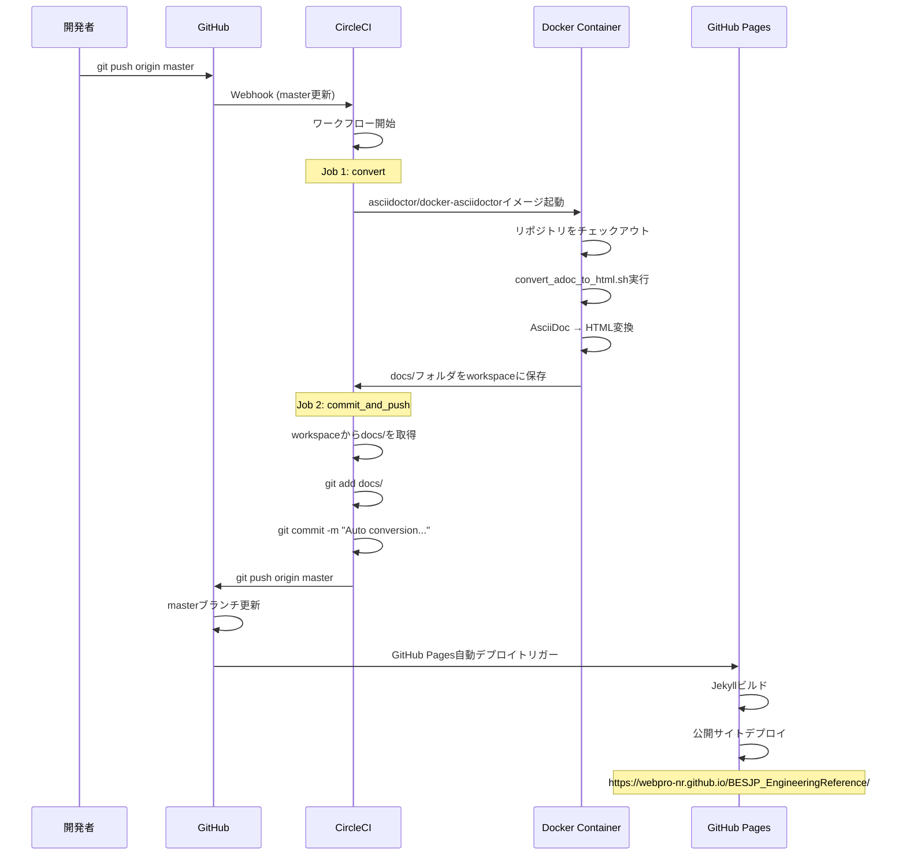
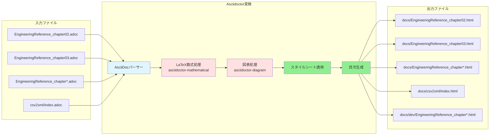
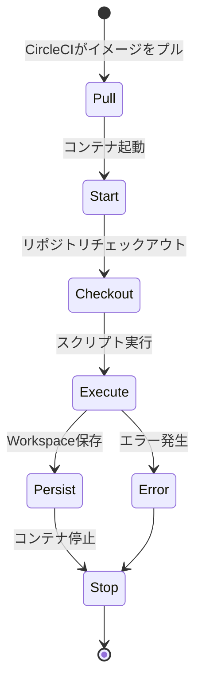
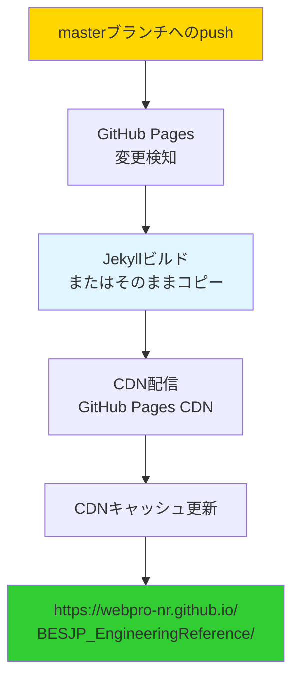
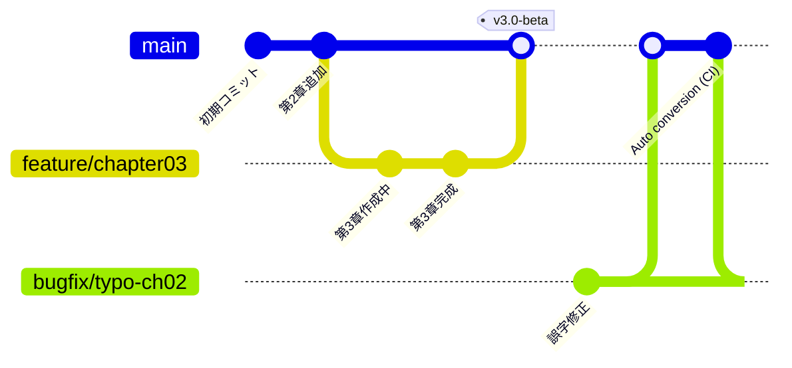
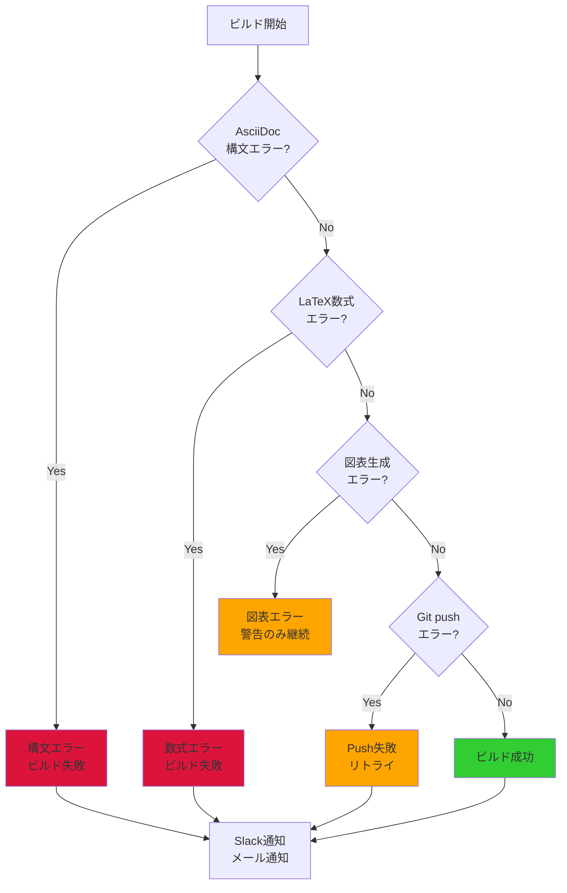

# CI/CDパイプラインとデプロイメント構成

## 1. CI/CDパイプライン全体図



## 2. CircleCIワークフロー詳細

### 2.1 config.yml構造

```yaml
version: 2
jobs:
  convert:
    docker:
      - image: asciidoctor/docker-asciidoctor
    steps:
      - checkout
      - run:
          name: AsciiDoc to HTML conversion
          command: |
            cd /home/circleci/project
            sh convert_adoc_to_html.sh
      - persist_to_workspace:
          root: .
          paths:
            - docs

  commit_and_push:
    docker:
      - image: circleci/node:10.15.3
    steps:
      - checkout
      - attach_workspace:
          at: .
      - run:
          name: Commit and push HTML files
          command: |
            git config user.name "CircleCI"
            git config user.email "circleci@example.com"
            git add docs/
            git commit -m "Auto conversion. (https://circleci.com/gh/WEBPRO-NR/BESJP_EngineeringReference/${CIRCLE_BUILD_NUM}) [skip ci]"
            git push origin master

workflows:
  version: 2
  build_and_deploy:
    jobs:
      - convert:
          filters:
            branches:
              only: master
      - commit_and_push:
          requires:
            - convert
          filters:
            branches:
              only: master
```

### 2.2 ワークフロー実行フロー



## 3. ビルドスクリプト詳細

### 3.1 convert_adoc_to_html.sh

```bash
#!/bin/bash

# AsciiDocファイルをHTMLに変換

# メインドキュメントの変換
for chapter in EngineeringReference_chapter*.adoc; do
    asciidoctor \
        -r asciidoctor-diagram \
        -r asciidoctor-mathematical \
        -a stem=latexmath \
        -a toc=left \
        -a toclevels=3 \
        -a sectnums \
        -a stylesheet=./css/asciidoctor.css \
        -D docs \
        $chapter
done

# CSV→XML変換仕様の変換
asciidoctor \
    -r asciidoctor-diagram \
    -a toc=left \
    -a toclevels=2 \
    -D docs/csv2xml \
    csv2xml/index.adoc

# 開発者用ドキュメント（詳細版）の変換
for chapter in EngineeringReference_chapter*.adoc; do
    asciidoctor \
        -r asciidoctor-diagram \
        -r asciidoctor-mathematical \
        -a stem=latexmath \
        -a toc=left \
        -a toclevels=4 \
        -a sectnums \
        -a dev=true \
        -D docs/dev \
        $chapter
done
```

### 3.2 変換の詳細フロー



## 4. Dockerコンテナ構成

### 4.1 使用イメージ

**Job 1: convert**
- イメージ: `asciidoctor/docker-asciidoctor:latest`
- 含まれるツール:
  - asciidoctor（AsciiDoc→HTML変換）
  - asciidoctor-diagram（PlantUML、Graphviz等）
  - asciidoctor-mathematical（LaTeX数式処理）
  - Ruby 2.x
  - Java（diagram用）

**Job 2: commit_and_push**
- イメージ: `circleci/node:10.15.3`
- 含まれるツール:
  - Node.js 10.15.3
  - npm
  - git
  - bash

### 4.2 コンテナライフサイクル



## 5. GitHub Pages デプロイメント

### 5.1 GitHub Pages設定

```yaml
# リポジトリ設定
Source Branch: master
Source Folder: /docs

# Jekyll設定（自動）
Theme: なし（静的HTML）
Base URL: /BESJP_EngineeringReference/
```

### 5.2 公開ディレクトリ構造

```
docs/
├── index.html                              # トップページ
├── EngineeringReference_chapter02.html     # 第2章（空調）
├── EngineeringReference_chapter03.html     # 第3章（換気）
├── EngineeringReference_chapter04.html     # 第4章（照明）
├── EngineeringReference_chapter05.html     # 第5章（給湯）
├── EngineeringReference_chapter06.html     # 第6章（昇降機）
├── EngineeringReference_chapter08.html     # 第8章（コージェネ）
├── EngineeringReference_chapter09.html     # 第9章（その他）
├── EngineeringReference_chapter10.html     # 第10章（基準値）
├── csv2xml/
│   └── index.html                          # CSV→XML変換仕様
├── dev/
│   ├── EngineeringReference_chapter02.html # 開発者用（詳細版）
│   ├── EngineeringReference_chapter03.html
│   └── ...
├── images/                                 # 画像リソース
│   ├── chapter02/
│   ├── chapter03/
│   └── ...
├── css/
│   └── asciidoctor.css                     # スタイルシート
└── dependency.svg                          # 依存関係図
```

### 5.3 GitHub Pages デプロイフロー



## 6. ブランチ戦略



### ブランチ命名規則

| ブランチ種別 | 命名規則 | 例 |
|----------|---------|-----|
| メイン | master | master |
| 機能追加 | feature/機能名 | feature/chapter11 |
| バグ修正 | bugfix/内容 | bugfix/typo-ch02 |
| 数式修正 | fix/内容 | fix/equation-2-7-14 |

### マージ戦略

1. **feature/bugfix → master**: プルリクエスト必須
2. **レビュー**: 最低1人の承認必要
3. **マージ後**: CI/CDが自動実行
4. **デプロイ**: 自動デプロイ（約3～5分）

## 7. 環境変数とシークレット

### CircleCI環境変数

| 変数名 | 説明 | 設定場所 |
|-------|------|---------|
| CIRCLE_BUILD_NUM | ビルド番号 | CircleCI自動設定 |
| CIRCLE_BRANCH | ブランチ名 | CircleCI自動設定 |
| CIRCLE_PROJECT_USERNAME | プロジェクトユーザー名 | CircleCI自動設定 |
| CIRCLE_PROJECT_REPONAME | リポジトリ名 | CircleCI自動設定 |

### GitHubアクセストークン

- **用途**: CircleCIからGitHubへのpush
- **スコープ**: repo（フルアクセス）
- **設定**: CircleCI Project Settings → Environment Variables

## 8. ビルド時間とパフォーマンス

### 典型的なビルド時間

| フェーズ | 時間 | 説明 |
|---------|-----|------|
| checkout | 5～10秒 | リポジトリクローン |
| convert | 30～60秒 | AsciiDoc→HTML変換 |
| persist_to_workspace | 5秒 | workspaceへの保存 |
| attach_workspace | 5秒 | workspaceからの取得 |
| commit_and_push | 10～20秒 | コミット&プッシュ |
| **合計** | **1～2分** | Job 1 + Job 2 |

### GitHub Pages デプロイ時間

| フェーズ | 時間 | 説明 |
|---------|-----|------|
| トリガー検知 | 1～2分 | GitHub内部処理 |
| ビルド | 30秒～1分 | Jekyll処理 |
| デプロイ | 30秒～1分 | CDN配信 |
| **合計** | **2～4分** | push後から公開まで |

### 最適化のポイント

1. **並列化**: Job 1とJob 2は直列（Job 2はJob 1に依存）
2. **キャッシュ**: Dockerイメージはキャッシュ済み
3. **増分ビルド**: 全ファイルを毎回変換（増分ビルドなし）
4. **ファイルサイズ**: HTMLファイルは比較的小さい（各章数百KB）

## 9. エラーハンドリング

### ビルドエラーの種類



### エラー通知

- **成功時**: 通知なし（Slackのみ）
- **失敗時**:
  - CircleCIのビルドログにエラー詳細
  - GitHub上のコミット横にXマーク表示
  - 開発者へメール通知（設定による）

## 10. セキュリティ考慮事項

### アクセス制御

| リソース | アクセス権 | 制御方法 |
|---------|----------|---------|
| GitHubリポジトリ | public（読取）/ 限定（書込） | GitHub Organization設定 |
| CircleCI | チームメンバーのみ | CircleCI Project設定 |
| GitHub Pages | public（全世界公開） | 制御不可 |
| シークレット | 管理者のみ | CircleCI Environment Variables |

### 脆弱性対策

1. **依存関係の更新**: Dockerイメージの定期更新
2. **シークレット管理**: 環境変数でトークン管理
3. **[skip ci]タグ**: 無限ループ防止
4. **ブランチ保護**: masterへの直接pushを禁止

### 監査ログ

- **GitHubアクティビティ**: すべてのコミット履歴
- **CircleCIビルドログ**: すべてのビルド実行履歴
- **GitHub Pagesアクセスログ**: アクセス統計（限定的）

## 11. スケーリングとパフォーマンス

### 現在のリソース使用量

| リソース | 使用量 | 上限 |
|---------|-------|-----|
| CircleCI無料プラン | 月間1000分 | 1000分/月 |
| GitHub Pagesストレージ | 約50MB | 1GB |
| GitHub Pages帯域幅 | 不明 | 100GB/月 |
| ビルド頻度 | 週1～5回 | 無制限 |

### スケーリング戦略

**水平スケーリング:**
- 複数ブランチでの並行開発
- 章別の独立ビルド（現在は全体ビルド）

**垂直スケーリング:**
- CircleCI有料プランへのアップグレード
- より高速なDockerイメージ使用

## 12. まとめ

WebproシステムのCI/CDパイプラインは以下の特徴を持ちます：

1. **完全自動化**: masterへのpushだけで公開まで完了
2. **高速**: 1～2分でビルド、2～4分で公開
3. **信頼性**: Dockerコンテナによる一貫した環境
4. **透明性**: すべてのビルドログが公開
5. **コスト効率**: 無料プラン内で運用可能
6. **拡張性**: 新規章の追加が容易
7. **セキュリティ**: シークレット管理と監査ログ

このCI/CDパイプラインにより、ドキュメントの継続的改善と迅速な公開を実現しています。
