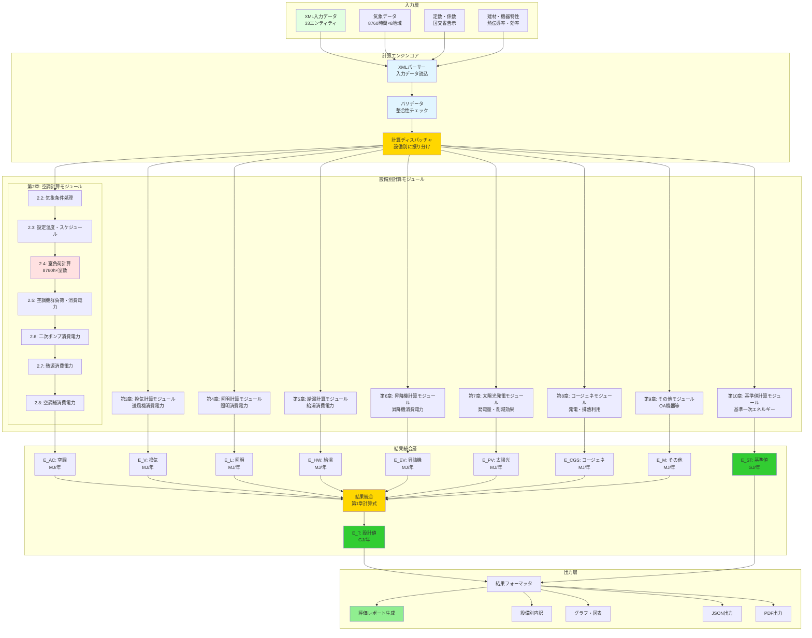
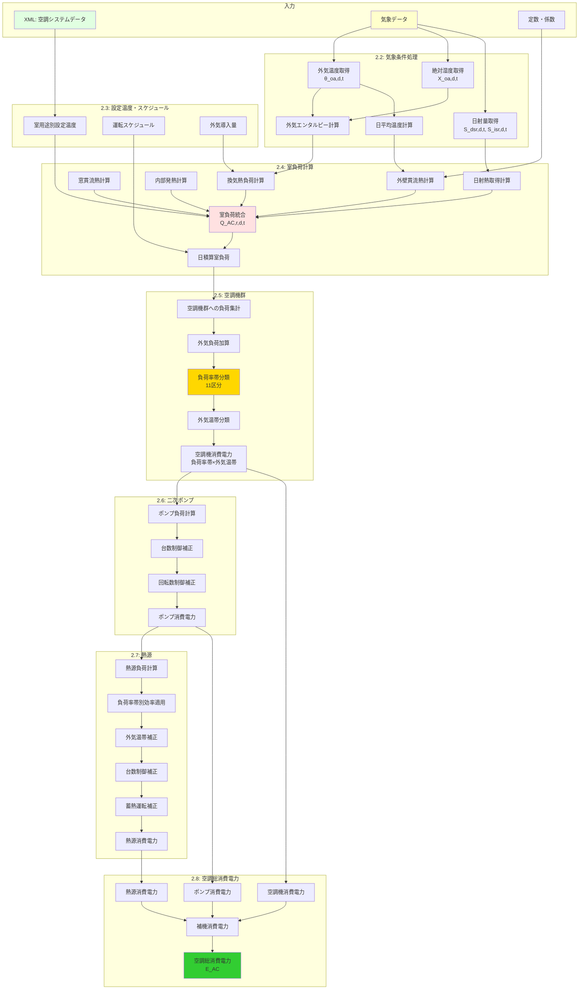
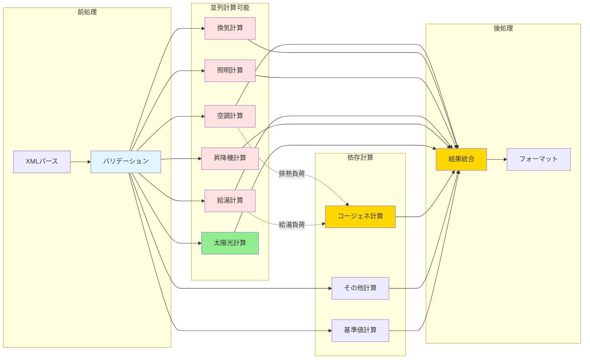
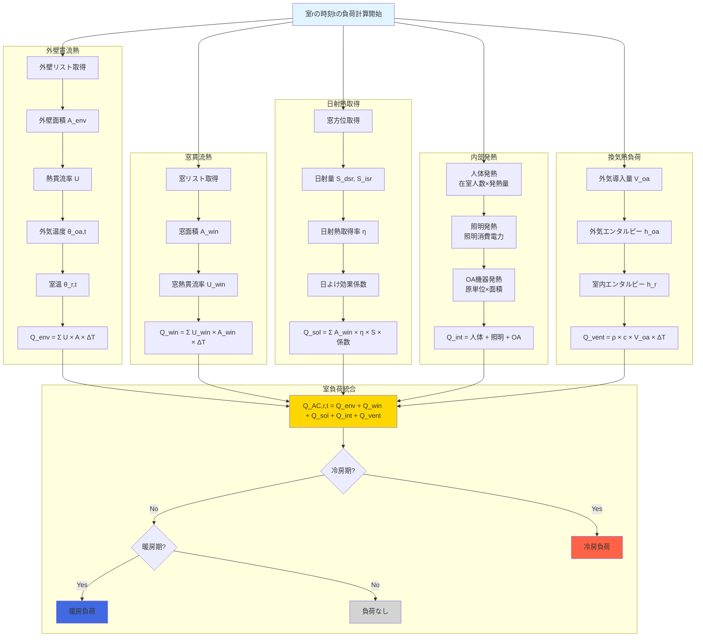
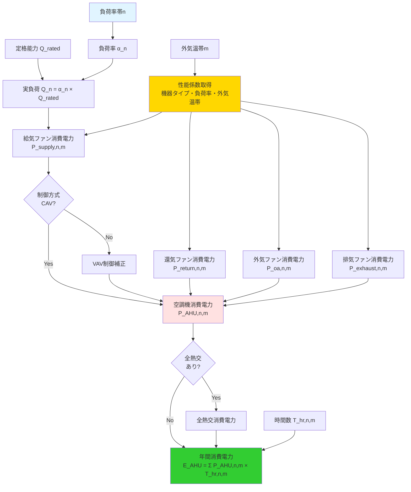
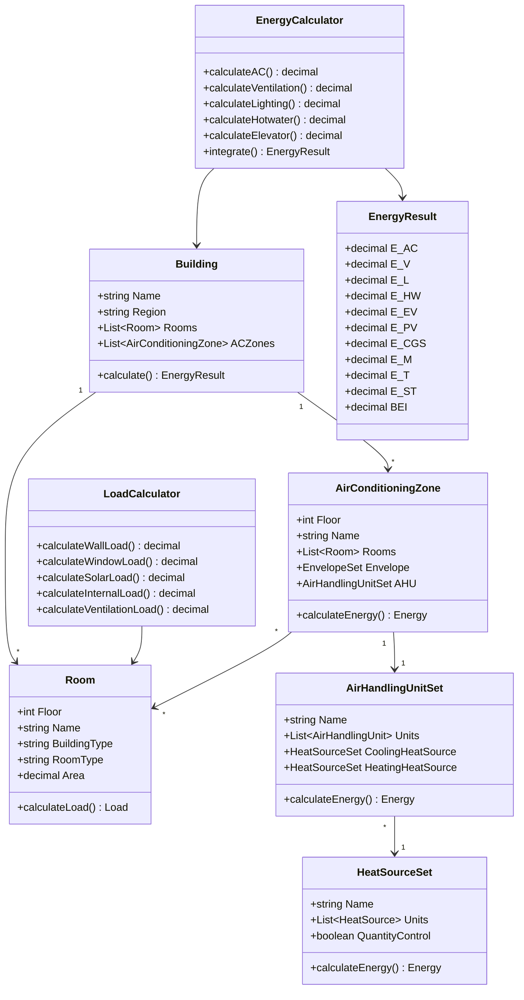
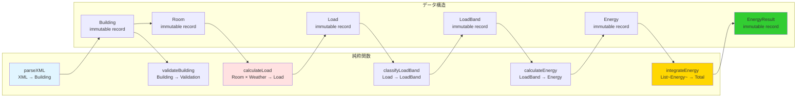
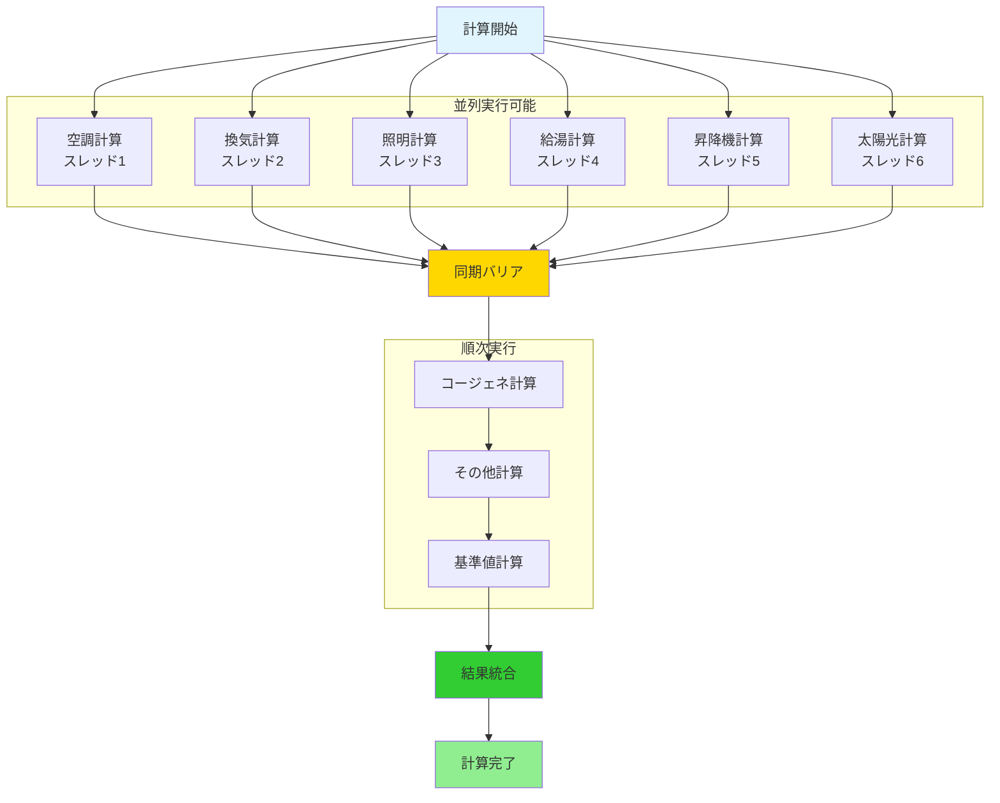
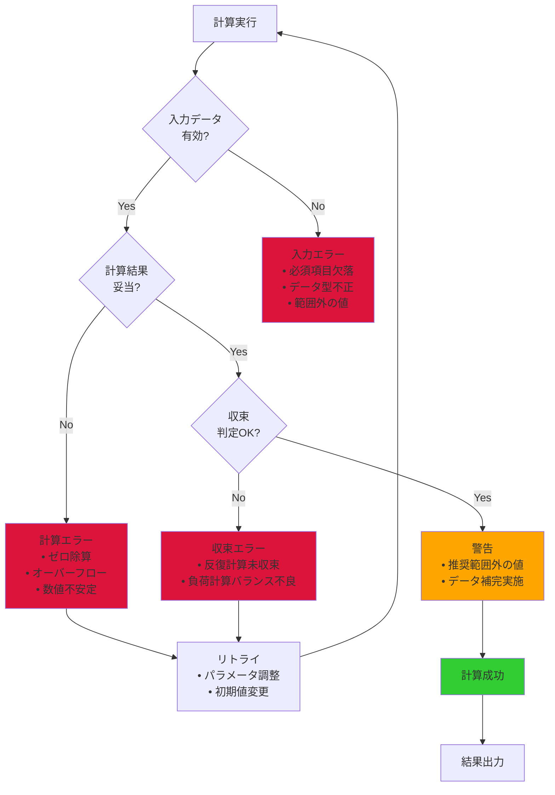

# 計算エンジンの構成

## 1. 計算エンジン全体アーキテクチャ



## 2. 空調計算モジュールの詳細構成



## 3. 計算モジュール間のデータフロー



## 4. 負荷計算エンジンの詳細

### 4.1 室負荷計算エンジン



### 4.2 負荷率帯分類エンジン

```mermaid
flowchart TD
    INPUT[8760時間の負荷データ<br/>Q_t [W]]
    RATED[定格能力 Q_rated [W]]

    CALC[各時刻tの負荷率計算<br/>α_t = Q_t / Q_rated]

    CLASSIFY[11区分への分類]

    subgraph "負荷率帯"
        B0[0-10%]
        B1[10-20%]
        B2[20-30%]
        B3[30-40%]
        B4[40-50%]
        B5[50-60%]
        B6[60-70%]
        B7[70-80%]
        B8[80-90%]
        B9[90-100%]
        B10[100%以上]
    end

    COUNT[各区分の時間数集計<br/>T_hr,n [h]]

    TEMP[外気温帯も同時に分類]

    MATRIX[負荷率帯×外気温帯<br/>の2次元マトリクス]

    INPUT --> CALC
    RATED --> CALC
    CALC --> CLASSIFY

    CLASSIFY --> B0
    CLASSIFY --> B1
    CLASSIFY --> B2
    CLASSIFY --> B3
    CLASSIFY --> B4
    CLASSIFY --> B5
    CLASSIFY --> B6
    CLASSIFY --> B7
    CLASSIFY --> B8
    CLASSIFY --> B9
    CLASSIFY --> B10

    B0 --> COUNT
    B1 --> COUNT
    B2 --> COUNT
    B3 --> COUNT
    B4 --> COUNT
    B5 --> COUNT
    B6 --> COUNT
    B7 --> COUNT
    B8 --> COUNT
    B9 --> COUNT
    B10 --> COUNT

    COUNT --> TEMP
    TEMP --> MATRIX

    style INPUT fill:#e1ffe1
    style CALC fill:#e1f5ff
    style CLASSIFY fill:#ffd700
    style MATRIX fill:#32cd32
```

## 5. エネルギー消費量計算エンジン

### 5.1 空調機消費電力計算



### 5.2 熱源消費電力計算

```mermaid
flowchart TD
    LOAD[熱源負荷<br/>Q_hs,n [kW]]
    TYPE[熱源機種<br/>Type]
    RATED_CAP[定格能力<br/>Q_hs,rated [kW]]
    LOAD_RATIO[負荷率<br/>α_hs,n = Q_hs,n / Q_hs,rated]

    CURVE[効率曲線取得<br/>COP_n = f(α_hs,n)]

    TEMP_BAND[外気温帯m]
    TEMP_COEFF[外気温帯補正係数<br/>f_temp,m]

    STORAGE{蓄熱<br/>あり?}
    STORAGE_MODE[蓄熱モード<br/>追掛/氷蓄熱/水蓄熱]
    STORAGE_COEFF[蓄熱運転補正]

    COUNT_CTRL{台数制御<br/>あり?}
    COUNT_COEFF[台数制御補正]

    POWER_MAIN[主機消費電力<br/>P_main,n,m = Q_hs,n / COP × 補正]
    POWER_SUB[補機消費電力<br/>P_sub,n,m]
    POWER_PUMP1[一次ポンプ<br/>P_pump1,n,m]
    POWER_CT_FAN[冷却塔ファン<br/>P_ct_fan,n,m]
    POWER_CT_PUMP[冷却水ポンプ<br/>P_ct_pump,n,m]

    TOTAL_HS[熱源消費電力<br/>P_hs,n,m]
    ANNUAL_HS[年間消費電力<br/>E_HS = Σ P_hs,n,m × T_hr,n,m]

    LOAD --> LOAD_RATIO
    RATED_CAP --> LOAD_RATIO
    TYPE --> CURVE
    LOAD_RATIO --> CURVE

    CURVE --> TEMP_COEFF
    TEMP_BAND --> TEMP_COEFF

    TEMP_COEFF --> STORAGE
    STORAGE -->|Yes| STORAGE_MODE
    STORAGE_MODE --> STORAGE_COEFF
    STORAGE -->|No| COUNT_CTRL
    STORAGE_COEFF --> COUNT_CTRL

    COUNT_CTRL -->|Yes| COUNT_COEFF
    COUNT_CTRL -->|No| POWER_MAIN
    COUNT_COEFF --> POWER_MAIN

    POWER_MAIN --> TOTAL_HS
    POWER_SUB --> TOTAL_HS
    POWER_PUMP1 --> TOTAL_HS
    POWER_CT_FAN --> TOTAL_HS
    POWER_CT_PUMP --> TOTAL_HS

    TOTAL_HS --> ANNUAL_HS

    style LOAD fill:#e1ffe1
    style CURVE fill:#ffd700
    style TEMP_COEFF fill:#e1f5ff
    style TOTAL_HS fill:#ffe1e1
    style ANNUAL_HS fill:#32cd32
```

## 6. 計算エンジンの実装パターン

### 6.1 オブジェクト指向設計（推奨）



### 6.2 関数型設計（代替案）



## 7. パフォーマンス最適化戦略

### 7.1 並列計算の可能性



### 7.2 キャッシュ戦略

| データ | キャッシュ対象 | 理由 |
|-------|------------|------|
| 気象データ | メモリキャッシュ | 8760時間×8地域＝70080レコード、頻繁にアクセス |
| 定数・係数 | メモリキャッシュ | 変更頻度低い、サイズ小 |
| 建材物性値 | メモリキャッシュ | 変更頻度低い |
| 室負荷計算結果 | ディスクキャッシュ | 8760時間×室数、再計算コスト高 |
| 負荷率帯分類結果 | メモリキャッシュ | 小サイズ、頻繁に参照 |

### 7.3 計算時間見積もり（中規模建物）

| 計算フェーズ | 時間 | 説明 |
|-----------|-----|------|
| XMLパース | 0.1秒 | 500KBのXMLファイル |
| バリデーション | 0.2秒 | 整合性チェック |
| 気象データ読込 | 0.5秒 | 70080レコード |
| 空調負荷計算 | 10～30秒 | 8760h×50室＝438,000計算 |
| 空調機消費電力 | 2～5秒 | 負荷率帯×外気温帯×機器数 |
| 熱源消費電力 | 2～5秒 | 負荷率帯×外気温帯×熱源数 |
| 換気計算 | 1～2秒 | 送風機数×運転時間 |
| 照明計算 | 1～2秒 | 照明機器数×年間点灯時間 |
| 給湯計算 | 1～3秒 | 365日×給湯箇所数 |
| その他計算 | 1秒 | 単純計算 |
| 結果統合 | 0.5秒 | 統合・フォーマット |
| **合計** | **20～50秒** | シングルスレッド実行 |

**並列実行時の見積もり:** 10～20秒（6コア並列の場合）

## 8. エラーハンドリングと例外処理



## 9. まとめ

Webpro計算エンジンは以下の特徴を持ちます：

1. **モジュール化**: 設備別に独立した計算モジュール
2. **並列化可能**: 空調・換気・照明等が並列実行可能
3. **スケーラブル**: 室数・機器数に応じて計算量が線形に増加
4. **精密**: 8760時間×負荷率帯×外気温帯の詳細計算
5. **透明性**: すべての計算式が公開仕様に従う
6. **拡張性**: 新規設備カテゴリの追加が容易
7. **高速**: 中規模建物で20～50秒（並列化で10～20秒）
8. **堅牢**: 多段階のエラーチェックと例外処理

このアーキテクチャにより、正確かつ高速な建築物エネルギー性能評価を実現しています。
